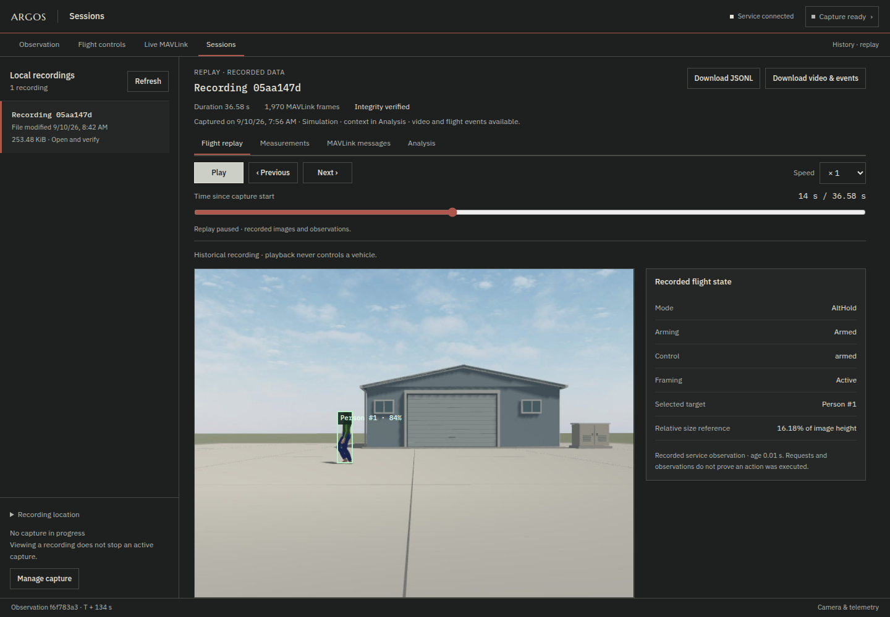

# ARGOS

**A local console for drone observation, MAVLink diagnostics, recorded-session analysis and manual simulation flight.**

ARGOS brings camera images, received measurements and reception incidents into
one operator interface. **Live MAVLink** exposes protocol
details; **Sessions** lets you replay captured video, matched detections and
sampled flight state alongside telemetry, or inspect MAVLink messages and reception gaps.
**Flight controls** adds mouse, touch and optional keyboard controls for a dedicated
GPS-free Gazebo/ArduPilot SITL session.


The console remains passive by default. Manual flight requires the explicit
`--sim-control` option and the [isolated simulation profile](docs/web-control.md).
It is not enabled for physical hardware. Neutral controls do not hold horizontal
position: the simulated drone can drift without GPS.
Optional [person detection](docs/vision.md) and [visual framing](docs/framing.md)
add image observations, Full framing in AltHold and framing with pilot-controlled
throttle in Stabilize.
Other experimental perception, guidance and simulation modules are tested
separately. Onboard autonomy and swarm coordination are research directions,
not capabilities delivered by this interface.

The interface is in English. This documentation uses its on-screen labels
when describing navigation.

## Try the console

Verified environment: **Ubuntu 24.04, Python 3.12**. The package declares Python
3.11 or newer; other OS/version combinations have not all been validated.
Physical camera input uses Linux/V4L2 and still needs testing on the chosen
hardware. Gazebo is required for live simulation; recorded-flight replay does not use it.

From a source checkout, install the console and MAVLink reader:

```sh
python3 -m venv .venv
. .venv/bin/activate
python -m pip install -e '.[console,mavlink]'
```

### Explore a recorded flight without a simulator

Start with the [provided inspection-yard flight](examples/demo-flight/README.md):
36 seconds of actual Gazebo/ArduPilot SITL flight, captured by ARGOS. It includes
the camera images, matched detections, sampled flight state, request events and
received telemetry. The two recording files are included in this source checkout.

```sh
python examples/verify_demo_flight.py
python -m argos.console --recordings-dir examples/demo-flight --port 8082
```

Open **http://127.0.0.1:8082 → Sessions → Recording 05aa147d**. **Flight replay**
opens automatically for that recording. Try **Play**, drag the time cursor, or
select a flight event to jump to it. The [guided timeline](examples/demo-flight/README.md)
points to target selection, Engage, Closer, Farther, manual takeover and landing.
Open **Measurements**, **MAVLink messages** and **Analysis** to inspect the
received data behind the flight.

This is the actual ARGOS console reading a completed recording. Playback is
interactive; the historical flight cannot be steered or changed. Gazebo, SITL,
camera hardware, an ONNX model and OpenCV are not needed for this replay. No live
source is configured, and flight control is disabled in this invocation. Port
8082 keeps it separate from the manual simulation on 8081.



The original [58-frame ground telemetry extract](examples/demo/README.md) remains
available as a smaller protocol-analysis example.

To start an empty console for your own sources, run `python -m argos.console`
and open **http://127.0.0.1:8080**. Configure sources at startup or in **Sources**;
a missing camera is never replaced with the prerecorded flight. The server
listens on localhost only. For personal captures, use the normal recording
directory rather than the distributed example directory.

### Receive the SITL camera and telemetry

The [SITL + Gazebo guide](docs/sitl-observation.md) specifies the repositories,
revisions, model preparation and three processes needed to reproduce ground
observation with Gazebo Harmonic and ArduPilot SITL. The [session guide](docs/running.md)
covers shutdown, restart, tmux and access from another computer over SSH.

### Fly the simulation with mouse or touch

One supported Linux PC can run the simulator, console and browser together.
A second computer and SSH tunnel are optional; the commands below are local.

After installing the pinned simulator dependencies from the SITL guide, start
the separate web-control session from the ARGOS repository root:

```sh
.venv/bin/python examples/run_web_control.py \
  --ardupilot-dir ../ardupilot \
  --gazebo-dir ../ardupilot_gazebo
```

Open **http://127.0.0.1:8081** and choose **Flight controls**. Take control, select
AltHold or Stabilize on the ground, prepare and arm. AltHold uses held
climb/descent buttons; Stabilize uses a slider and +/− buttons for manual
throttle. Direction buttons work while held; touch supports simultaneous axes.
Once airborne, select the other flight mode and use **Switch mode**. The service
confirms the change from the autopilot and transfers the vertical input; entering
Stabilize resumes manual throttle. Keyboard shortcuts are optional. The [web-control guide](docs/web-control.md)
explains the flight sequence, input release, GPS-free profile and current limits.

For the compact hangar scene, use `--scene inspection` with the person assets
and vision options documented in the [Gazebo scene guide](examples/gazebo/README.md).

The launcher uses its own model copy, Gazebo partition, ports and SITL files;
**Ctrl-C** stops its three child processes. It does not modify the installed
models or an existing observation session.

## Available features

| View | Purpose |
| --- | --- |
| Observation | Camera image, reported mode, battery, attitude and NED position; each reception has its own freshness limit. |
| Flight controls | Opt-in manual Gazebo/SITL flight, held mouse/touch controls and optional keyboard, with the live camera visible. |
| Incidents and recovery (incidents and recovery) | Available data, observed interruptions, receiver reopening and reception recovery. |
| Live MAVLink (live MAVLink) | Received message types and components, counters, approximate rates, fields and bytes; the display can be frozen. |
| Sessions | Captured video and matched boxes, framing intervals and centering/relative-size curves linked to replay, flight events, telemetry and reception analysis. |

MAVLink transports include UDP, TCP and serial. The `ardupilotmega` dialect is
used to decode MAVLink 1 and 2. Images come from a Gazebo sensor or a local V4L2
device. The JSONL journal retains received MAVLink frames. Optional visual capture
adds JPEG images, matched detections, sampled control state and operator-request
events in a separate SQLite file; it is not a complete outgoing-command log.
Analog video alone supplies no MAVLink measurements. A recent reception does not measure
radio latency or the physical age of a sensor measurement; an interruption alone
does not identify its cause.

Recordings are stored in `~/.local/share/argos/recordings/`, or in
`$XDG_DATA_HOME/argos/recordings/` when that variable contains an absolute path.
Use `--recordings-dir` to choose another directory. Recording limits and closure
reasons are described in the [console guide](docs/console.md).

## Repository layout

| Directory | Role |
| --- | --- |
| `argos/console/` | Receivers, console state, recording, archives and local API. |
| `argos/console/static/` | HTML/CSS/JavaScript interface with local fonts; no build server required. |
| `argos/backends/mavlink/` | Transports, decoding, measurement validation and recording format. |
| `argos/core/`, `argos/perception/`, `argos/guidance/`, `argos/safety/` | Contracts and experiments, plus the optional live image detector, tracker and framing law. |
| `argos/backends/attitude_sim.py`, `argos/harness/` | Simulation and instrumentation, including link statistics reused by live MAVLink. |
| `tests/`, `examples/` | Automated checks and runnable examples. |

Further reading: [architecture and data flow](docs/architecture.md), [console and API](docs/console.md),
[manual web flight and control API](docs/web-control.md), [visual framing](docs/framing.md),
[MAVLink transport and recording format](docs/mavlink-transport.md),
[validation environment](docs/validation.md).

## Verify a change

```sh
python -m pip install -e '.[dev,mavlink,plot,console,console-test]'
python -m pytest -q
```

Browser tests use Node.js 22 and Playwright:

```sh
npm ci
npx playwright install --with-deps chromium
npm run test:browser
```

They use an isolated local server and test responses, without connecting to a
simulator or an existing console. CI checks Python behavior, browser workflows
and wheel installation with its web assets. Node.js and Playwright are not
required to use ARGOS.

C++, a custom MAVLink dialect and a real onboard video transport remain future
work. Reception tests that simulate faults are development tools; the interface
does not expose fault-injection controls.

## License

ARGOS code is distributed under the [MIT license](LICENSE). Bundled fonts retain
their [OFL licenses and provenance](argos/console/static/fonts/README.md).
ArduPilot and its Gazebo plugin are external projects with their own licenses.

Optional [camera-based person detection and tracking](docs/vision.md) adds a
walking-person Gazebo scene and CPU inference during manual simulated flight.
The pilot can explicitly engage experimental [visual framing](docs/framing.md)
with `--framing`. Manual attitude input stops the assistance; in the Stabilize
manual-throttle variant, throttle adjustments keep framing active. This does not
establish outdoor following or horizontal position hold.

**Gentle / Normal / Responsive** adjusts approach and retreat response while
keeping centering settings and command limits unchanged. After a visual capture,
open **Sessions → Flight replay → Framing report** to inspect the observed
assistance intervals, relative-size error and interruptions against the video.
