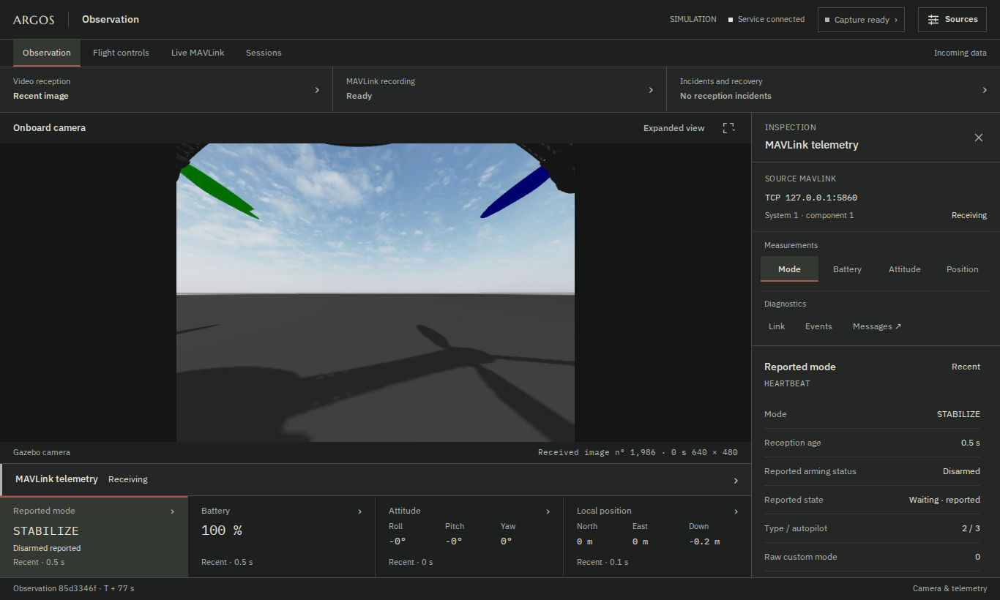

# ARGOS

**A local console for drone observation, MAVLink diagnostics, recorded-session analysis and manual simulation flight.**

ARGOS brings camera images, received measurements and reception incidents into
one operator interface. **MAVLink en direct** (live MAVLink) exposes protocol
details; **Sessions** lets you replay a recording, inspect its frames and
examine reception rates and gaps.
**Pilotage** adds mouse, touch and optional keyboard controls for a dedicated
GPS-free Gazebo/ArduPilot SITL session.



The console remains passive by default. Manual flight requires the explicit
`--sim-control` option and the [isolated simulation profile](docs/web-control.md).
It is not enabled for physical hardware. Neutral controls do not hold horizontal
position: the simulated drone can drift without GPS.
The repository also contains experimental perception, guidance and simulation
modules, tested separately; they are not connected to the console's live
receivers. Onboard autonomy and swarm coordination are research directions,
not capabilities delivered by this interface.

The current UI is in French. This documentation uses its on-screen labels
when describing navigation.

## Try the console

Verified environment: **Ubuntu 24.04, Python 3.12**. The package declares Python
3.11 or newer; other OS/version combinations have not all been validated.
Physical camera input uses Linux/V4L2 and still needs testing on the chosen
hardware. Gazebo is only required for the simulated-camera demonstration.

From the repository root:

```sh
python3 -m venv .venv
. .venv/bin/activate
python -m pip install -e '.[console,mavlink]'
python -m argos.console
```

Open **http://127.0.0.1:8080**. The console starts without a configured source;
it does not substitute a demo video for a missing camera. Configure sources
at startup or in **Sources**. The server listens on localhost only.

### Explore a session without a simulator

A short recording captured from ArduPilot SITL on the ground is provided in
[examples/demo](examples/demo/README.md). It contains 58 selected frames with
their original bytes and reception timestamps. Its provenance and the metadata
that was not recorded are documented explicitly.

```sh
python examples/verify_demo.py
python -m argos.console --recordings-dir examples/demo --port 8081
```

Open **http://127.0.0.1:8081**, then **Sessions** and the single provided recording.
Explore **Mesures** (measurements), **Messages MAVLink** (MAVLink messages) and
**Analyse** (analysis). This is a replay demonstration; the Observation view
has no live image or telemetry.

### Receive the SITL camera and telemetry

The [SITL + Gazebo guide](docs/sitl-observation.md) specifies the repositories,
revisions, model preparation and three processes needed to reproduce ground
observation with Gazebo Harmonic and ArduPilot SITL. The [session guide](docs/running.md)
covers shutdown, restart, tmux and access from another computer over SSH.

### Fly the simulation with mouse or touch

After installing the pinned simulator dependencies from the SITL guide, start
the separate web-control session from the ARGOS repository root:

```sh
.venv/bin/python examples/run_web_control.py \
  --ardupilot-dir ../ardupilot \
  --gazebo-dir ../ardupilot_gazebo
```

Open **http://127.0.0.1:8081** and choose **Pilotage**. Take control, select
AltHold or Stabilize on the ground, prepare and arm. AltHold uses held
climb/descent buttons; Stabilize uses a slider and +/− buttons for manual
throttle. Direction buttons work while held; touch supports simultaneous axes.
Keyboard shortcuts are optional. The [web-control guide](docs/web-control.md)
explains the flight sequence, input release, GPS-free profile and current limits.

The launcher uses its own model copy, Gazebo partition, ports and SITL files;
**Ctrl-C** stops its three child processes. It does not modify the installed
models or an existing observation session.

## Available features

| View | Purpose |
| --- | --- |
| Observation | Camera image, reported mode, battery, attitude and NED position; each reception has its own freshness limit. |
| Pilotage | Opt-in manual Gazebo/SITL flight, held mouse/touch controls and optional keyboard, with the live camera visible. |
| Incidents et reprise (incidents and recovery) | Available data, observed interruptions, receiver reopening and reception recovery. |
| MAVLink en direct (live MAVLink) | Received message types and components, counters, approximate rates, fields and bytes; the display can be frozen. |
| Sessions | Verified recordings, replay at a selected time, raw messages, reception rates, age and gaps. |

MAVLink transports include UDP, TCP and serial. The `ardupilotmega` dialect is
used to decode MAVLink 1 and 2. Images come from a Gazebo sensor or a local V4L2
device. MAVLink journals record received frames, not outgoing pilot commands or
video. A recent reception does not measure
radio latency or the physical age of a sensor measurement; an interruption alone
does not identify its cause.

Recordings are stored in `~/.local/share/argos/recordings/`, or in
`$XDG_DATA_HOME/argos/recordings/` when that variable contains an absolute path.
Use `--recordings-dir` to choose another directory. Recording limits and closure
reasons are described in the [console guide](docs/console.md).

## Repository layout

| Directory | Role |
| --- | --- |
| `argos/console/` | Receivers, console state, recording, archives and local API. |
| `argos/console/static/` | HTML/CSS/JavaScript interface with local fonts; no build server required. |
| `argos/backends/mavlink/` | Transports, decoding, measurement validation and recording format. |
| `argos/core/`, `argos/perception/`, `argos/guidance/`, `argos/safety/` | Contracts and experimental components independent of the console. |
| `argos/backends/attitude_sim.py`, `argos/harness/` | Simulation and instrumentation, including link statistics reused by live MAVLink. |
| `tests/`, `examples/` | Automated checks and runnable examples. |

Further reading: [architecture and data flow](docs/architecture.md), [console and API](docs/console.md),
[manual web flight and control API](docs/web-control.md),
[MAVLink transport and recording format](docs/mavlink-transport.md),
[validation environment](docs/validation.md).

## Verify a change

```sh
python -m pip install -e '.[dev,mavlink,plot,console,console-test]'
python -m pytest -q
```

Browser tests use Node.js 22 and Playwright:

```sh
npm ci
npx playwright install --with-deps chromium
npm run test:browser
```

They use an isolated local server and test responses, without connecting to a
simulator or an existing console. CI checks Python behavior, browser workflows
and wheel installation with its web assets. Node.js and Playwright are not
required to use ARGOS.

C++, a custom MAVLink dialect and a real onboard video transport remain future
work. Reception tests that simulate faults are development tools; the interface
does not expose fault-injection controls.

## License

ARGOS code is distributed under the [MIT license](LICENSE). Bundled fonts retain
their [OFL licenses and provenance](argos/console/static/fonts/README.md).
ArduPilot and its Gazebo plugin are external projects with their own licenses.
