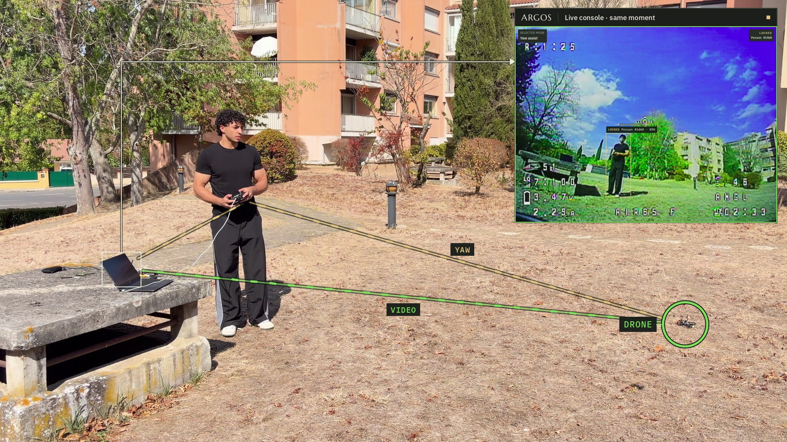
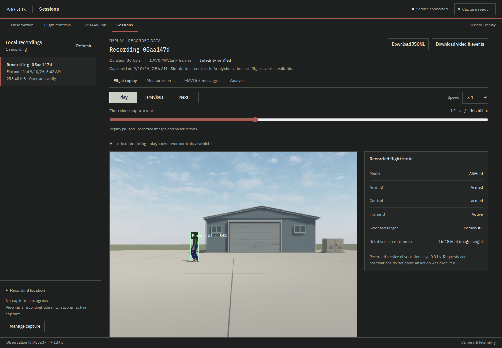

# ARGOS

I’m building ARGOS so an operator can give a drone a mission and let the drone
do it by itself.

I’m starting with one drone and simple missions. The goal is mission autonomy
with either a single drone or a swarm, depending on what’s needed.

[](https://victormonnot.com/projects/argos/)

*One step so far: ARGOS turns the drone to keep me centered in its camera image.
I still control the rest of the flight.*

**[Watch the demo and see the project timeline →](https://victormonnot.com/projects/argos/)**

## Where it is now

The first task is keeping a person in view. The drone sends its camera feed to
a computer on the ground, where ARGOS detects the person and works out the
correction to send through the radio. The pilot can take over with the sticks.

- **Real flights:** I’ve tested yaw assistance indoors and outdoors with a small
  FPV drone. Distance control didn’t work in the outdoor test, so I’m still
  working on it.
- **Simulation:** I use Gazebo and ArduPilot to test flight controls and visual
  framing. A person can be selected in the camera image, then the drone tries
  to keep them centered and at the same size in the image.
- **The interface:** I built a local web console to see the camera, detections,
  pilot inputs and radio status, inspect autopilot data (MAVLink), and record flights
  to replay and debug afterward.

Current work includes improving person detection, keeping track of the same
person when detections drop out, and making distance control work reliably.
Moving the compute onboard and autonomous missions come later; the setup above
still uses the ground computer and a pilot.

## Try a recorded flight

You can explore the interface without a drone or simulator. This repository
includes a **36-second Gazebo/ArduPilot flight recording**, with camera images,
detections, flight events and telemetry.



Clone the repository and install the replay dependencies. These commands are
verified on **Ubuntu 24.04 with Python 3.12**; the package requires Python 3.11+.

```sh
git clone https://github.com/victormonnot/argos.git
cd argos
python3 -m venv .venv
. .venv/bin/activate
python -m pip install -e '.[console,mavlink]'
python -m argos.console --recordings-dir examples/demo-flight --port 8082
```

Open **http://127.0.0.1:8082 → Sessions → Recording 05aa147d**, then press **Play**.
Scrub the timeline to see target selection, closer/farther requests and the
return to manual control. Open **Measurements**, **MAVLink messages** or
**Analysis** to inspect the recorded data. Stop the server with **Ctrl-C**.

This plays a completed simulation recording. It does not connect to hardware,
and playback does not rerun the detector. The [demo guide](examples/demo-flight/README.md)
has a short walkthrough, capture details and file verification instructions.

## Hardware and simulation

For your own sources, start an empty console with `python -m argos.console`
and open **http://127.0.0.1:8080**. Live camera input uses Linux/V4L2; the
simulator and radio workflows have their own dependencies and setup steps.

| What you want to do | Guide |
| --- | --- |
| Connect camera and telemetry, inspect messages, record and replay sessions | [Console](docs/console.md) · [MAVLink](docs/mavlink-transport.md) |
| Run Gazebo/ArduPilot and fly from the browser | [Simulator setup](docs/sitl-observation.md) · [Flight controls](docs/web-control.md) · [Visual framing](docs/framing.md) |
| Use physical-camera yaw assistance through a Pocket radio | [ARGOS FLY](docs/argos-fly.md) |
| Experiment with pitch assistance based on a person’s size in the image | [ARGOS DST](docs/argos-distance.md) |
| Capture real-flight video and pilot/radio observations | [Filming](docs/filming.md) · [Demo view](docs/demo-view.md) |
| Compare person detectors or load a custom model | [Detector comparison](docs/vision-comparison.md) · [Custom models](docs/custom-vision-models.md) |
| Investigate tracking and target loss on saved recordings | [Tracker comparison](docs/tracker-comparison.md) · [Target loss](docs/continuity-diagnostics.md) |

The physical workflows are experiments with specific radio profiles and receiver
checks. Apparent size is not a distance measurement in metres. Follow the
relevant guide for setup, pilot takeover and current limits.

**[All documentation →](docs/README.md)** — reading paths, hardware bench checks,
offline experiments and technical references.

## Development

[](https://github.com/victormonnot/argos/actions/workflows/ci.yml)

The core is Python, with a plain HTML/CSS/JavaScript interface and EdgeTX Lua
scripts for the radio. Browser assets are served locally; using the console
does not require Node.js or a frontend build.

| Directory | Contents |
| --- | --- |
| `argos/console/` | Web API, interface, camera/telemetry state, recording and replay |
| `argos/backends/` | MAVLink, radio links and simulation adapters |
| `argos/core/`, `argos/perception/`, `argos/guidance/`, `argos/safety/` | Shared contracts, detection/tracking, control laws and validation |
| `argos/harness/`, `examples/` | Offline experiments, simulator launchers and bundled recordings |
| `scripts/edgetx/` | Lua scripts for the Pocket radio |
| `tests/` | Python and browser checks |

See the [architecture guide](docs/architecture.md) for the component boundaries
and the [validation notes](docs/validation.md) for dated test reports.

### Verify a change

From the checkout, with the Python environment activated, run the same Python
checks as CI. Lua and FFmpeg enable the corresponding integration tests;
the `tracking` extra includes the optional vision/tracker dependencies.

```sh
sudo apt-get update
sudo apt-get install -y lua5.4 ffmpeg
python -m pip install -e '.[dev,mavlink,plot,console,console-test,radio-profile,tracking]'
python -m pytest -q -ra
python examples/verify_demo.py
python examples/verify_demo_flight.py
```

Browser tests use **Node.js 22** and Playwright:

```sh
npm ci
npx playwright install --with-deps chromium
npm run test:browser
```

They run against an isolated local server with simulated responses.
[CI](.github/workflows/ci.yml) also builds a wheel and checks its imports, CLI
and web assets in a separate environment. These checks exercise the software;
they do not establish real-flight performance.

## License

ARGOS code is [MIT licensed](LICENSE). Bundled [fonts](argos/console/static/fonts/README.md)
and [tracker code](argos/perception/_vendor/README.md) retain their own licenses
and attribution. ArduPilot and its Gazebo plugin are external projects;
the [recorded demo](examples/demo-flight/README.md#rendered-asset-attribution)
documents the rendered assets it uses.
