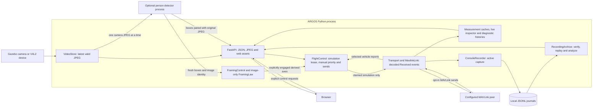

# Architecture

ARGOS integrates a local observation console: camera reception, MAVLink
inspection, recording and historical analysis, plus opt-in manual simulation
control, optional image-based person detection and explicit visual framing in
AltHold. The default console remains passive. This document explains how those
parts fit together and the boundaries of the implementation. For setup and
operator workflows, use the [console guide](console.md) and
[web-control guide](web-control.md); for wire and file
contracts, use the [MAVLink transport guide](mavlink-transport.md).

## Runtime and data flow

The supported entry point, `python -m argos.console`, starts one Python process
with FastAPI/Uvicorn on `127.0.0.1`. That process serves the browser assets, owns
the configured receivers and manages the local recording directory. It starts
without sources unless they are explicitly configured. With `--vision-model`,
a separate spawned inference process receives camera JPEG bytes only.

In the reference simulation, Gazebo and ArduPilot SITL run as separate processes.
ARGOS subscribes to a Gazebo camera topic and reads a MAVLink connection to SITL;
the server does not launch or supervise either simulator. The separate
[`run_web_control.py`](../examples/run_web_control.py) example supervises an
isolated Gazebo, SITL and console session for manual flight. A Linux V4L2 device can replace
the camera source. Camera and telemetry connections have independent lifecycles.

The arrows show the main data paths. Browser POST requests configure or reopen
receivers and start or stop recording. These actions send no MAVLink messages.
With `--sim-control`, a separate control path calls the transport's `send()`
method for pilot input, GCS heartbeat, parameter/status requests and explicit
mode/arming actions. Disabled or unclaimed control is passive. Recording capture
receives decoded inbound events; outgoing control messages are not recorded.

## Ownership and scheduling

[ConsoleSession](../argos/console/session.py) is the live runtime owner. It binds
the source configuration, monotonic clock, MAVLink link, measurement caches,
camera store, recorder and diagnostic histories. [app.py](../argos/console/app.py)
assembles the application and ties resource startup and cleanup to its lifespan.

| Work | Owner and execution context |
| --- | --- |
| MAVLink polling, measurement admission, live histories and capture writes | `ConsoleSession.tick()`, called by one asyncio task in the server event loop. |
| Optional manual control | `FlightControl` receives selected vehicle reports; the same session tick checks lease expiry and transmits current pilot inputs. HTTP mutations run on that event loop. |
| Gazebo images | Subscription callbacks publish into the thread-safe `VideoStore`. |
| Optional person detection | App-owned `VisionService`, serviced by `ConsoleSession.tick()`, submits bounded work to a spawned OpenCV process. Results and short-lived image-space associations are consumed without waiting on inference. |
| Optional visual framing | `FramingControl` owns target selection, freshness and takeover; `FramingLaw` updates derived axes on distinct analyzed images. `FlightControl` retains authority and the MAVLink send boundary. |
| V4L2 images | One worker thread owns the device reader and publishes into `VideoStore`. |
| Recording verification, indexing, replay and analysis | Archive calls run through `asyncio.to_thread`; a lock protects the shared archive cache. |
| Receiver reopening | Blocking replacement work runs in a thread; the session retains ownership until replacement or cleanup finishes. |
| Display state, selected panels, filters and replay cursor | JavaScript in the browser; these do not own the receivers. |

The receive task waits 50 ms between ticks. Each link poll limits its read work;
this is not a guaranteed 20 Hz schedule. Recording writes are synchronous in the
tick, so slow storage or CPU work can delay reception. The current process layout
does not provide hard real-time scheduling or guarantee lossless capture.

Each lease starts unprepared. The pilot selects AltHold or Stabilize and prepares
that mode while disarmed with a fresh landed report and neutral input. Arming
requires observed preparation, the checked profile and zero manual throttle.
AltHold maps vertical input to climb/descent; Stabilize maps explicit throttle
to pilot gas and retains it when a direction is released. Neither holds position.

With `--sim-framing`, explicit airborne engagement uses server-owned detection
boxes for yaw and apparent-height assistance. The `full` profile requires AltHold
and also requests vertical centering. The `pilot_throttle` profile requires
Stabilize: both the law and lifecycle output boundary enforce zero derived
vertical input, while `FlightControl` retains the latest explicit pilot throttle.
Manual attitude input stops either profile; Stabilize throttle changes preserve
assistance and do not acknowledge a target-loss takeover. Those changes still
invalidate stale mode-transfer input evidence. Firmware-mode switching clears
framing and requires explicit reselection/engagement afterward. Neutral browser
keepalives preserve authority but do not overwrite derived axes or acknowledge
target loss. An isolated missing or
low-confidence detection zeros corrections and permits same-ID recovery within
an absolute 600 ms pause. Expiry or other invalid observations latch a two-second
takeover deadline; no manual acknowledgement invokes the existing
landing/revocation path. Image-provider
failures cannot terminate manual/control servicing. The
[framing guide](framing.md) details intent/revision ordering, profile checks and
the absence of position, depth or metric range in the controller.

The browser sends current axes and throttle at 10 Hz with one input request in flight; the
service sends MANUAL_CONTROL at most every 50 ms while its lease is active and
the vehicle is not in the requested landing phase. A lease expires after 0.65 s
without valid input, on the next tick, and cannot be revived by an old token.
Release attempts a neutral attitude input and Land request when armed or when
arming is uncertain, then stops periodic input and GCS heartbeat. A Stabilize
handoff retains the last throttle for that one input until Land takes over. The
pinned SITL profile's GCS failsafe is a separate process/link-loss mechanism:
its 2 s deadline precedes the 3 s RC override expiry, so loss of the process does
not first restore the simulator's low underlying RC throttle. Explicit Land also
stops GCS heartbeat immediately, so browser updates cannot inhibit that fallback
after a refused or unconfirmed command. Only a new ground preparation resumes
pilot transmissions. See
[web-control.md](web-control.md) for the profile checks and their limits.

Camera conversion runs outside the store's short reader lock. The store retains
one valid JPEG instead of a frame queue, so an old queue cannot accumulate inside
ARGOS while the browser falls behind. Camera drivers may still buffer frames.

## From received bytes to displayed measurements

[MavlinkLink](../argos/backends/mavlink/link.py) frames and decodes the explicitly
configured UDP, TCP or serial stream using the `ardupilotmega` dialect. UDP
datagrams must contain complete frames; TCP and serial retain partial frames
between polls. A decoded `Received` event contains the original frame bytes,
fields, source identifiers, message type, sequence and local receipt timestamp.

Each decoded event reaches the recorder and live inspector **before** measurement
admission. This separates three responsibilities:

1. **Wire decoding** checks whether bytes form a known, CRC-valid MAVLink frame.
   Corrupt bytes are counted but do not become journal events. An unsupported
   message ID closes the link because its frame cannot be validated with the
   configured dialect.
2. **Inspection and capture** retain traffic from all decoded sources, including
   message types that the measurement display does not use. The live inspector
   keeps the latest frame per source/type; a journal keeps successive frames
   while capture is active.
3. **Measurement admission** selects the configured system/component and checks
   supported fields. A rejected value does not overwrite or refresh the last
   valid measurement. Its decoded frame remains available for diagnosis.

[TelemetryCache](../argos/backends/mavlink/telemetry.py) handles `HEARTBEAT`,
`ATTITUDE` and `LOCAL_POSITION_NED`.
[HealthCache](../argos/backends/mavlink/health.py) extracts battery information
from `SYS_STATUS`; its name does not imply a complete assessment of vehicle
health. [views.py](../argos/console/views.py) shares measurement presentation
between live observation and replay. It also converts non-finite values and
integers outside JavaScript's safe range to explicit strings for raw inspection,
without changing the recorded frame bytes.

Sequence statistics reuse [harness/link.py](../argos/harness/link.py). Their
channel or component scope must match the encoder's counter and requires its
complete, unfiltered stream. They describe locally observed traffic under that
assumption, rather than proving a radio-loss rate for arbitrary routed streams.

## Time, freshness and incidents

Live receipt ages use the session's monotonic clock. MAVLink timestamps mark
local processing during a poll; camera timestamps mark callback entry or return
from a device read. A GET request does not create a new reception or refresh an
old value.

Video, heartbeat, battery, attitude and position have independent age limits.
The browser advances ages from the last accepted state using `performance.now()`
and detects a service that has stopped progressing. This prevents a frozen server
response from keeping measurements apparently fresh. Expired video is withheld;
the frame endpoint returns an unavailable response when there is no recent valid
image.

Local receipt time is distinct from camera exposure time, autopilot time and UTC.
Capture metadata uses UTC to identify when a recording began. It does not
synchronize video with telemetry or establish physical sensor latency. Displaying
two configured sources together does not verify that they belong to the same
vehicle.

Two diagnostic paths deliberately stay separate:

- [ReceptionIncidents](../argos/console/incidents.py) groups observed missing or
  stale receptions and waits for sustained recovery. Notices are debounced;
  measurement expiry itself is immediate. Reopening a receiver alone does not
  establish that reception has recovered.
- [StatusTexts](../argos/console/status.py) retains the selected component's
  `STATUSTEXT` reports, alongside the declared state from `HEARTBEAT`. Chunked
  text keeps connection provenance and marks incomplete assembly. These are
  autopilot reports; silence is not an all-clear indication.

## Browser and source lifecycle

The frontend is packaged HTML, CSS, JavaScript and local fonts. It needs no build
server or CDN. The JavaScript is split by workflow:

| File | Responsibility |
| --- | --- |
| [app.js](../argos/console/static/app.js) | Observation shell, state/image polling, source controls, capture and live diagnostic display. |
| [live.js](../argos/console/static/live.js) | On-demand MAVLink inspection and display freezing. |
| [sessions.js](../argos/console/static/sessions.js) | Recording catalog, replay, cursor playback and paginated raw messages. |
| [analysis.js](../argos/console/static/analysis.js) | Historical reception curves, gaps and analysis filters. |
| [control.js](../argos/console/static/control.js) | Mouse/touch/keyboard input, explicit lease ownership, serialized input requests and release on loss of browser context. |

State, images and inspection data use separate HTTP requests. Freezing a view or
leaving a tab changes browser behavior; the server continues receiving and an
active recording continues until it is stopped or reaches a closure condition.
Manual control has a different lifecycle: leaving Flight controls, losing focus or
hiding the page releases its lease rather than continuing to pilot in the
background. Flight controls reuses Observation's camera instead of opening a second
video subscription.

Independent requests can complete after their context has changed. The frontend
checks session and receiver identities (`run_id`, video `source_id`, MAVLink
`connection_id`), and uses request counters and cancellation to discard outdated
responses. Historical views also bind requests to a journal revision. An image
from the previous camera or a reply for an earlier selection must not replace the
current view.

[ConsoleConfig](../argos/console/config.py) validates a source configuration
before replacement. A full replacement creates a new session; reopening one
receiver keeps the session and changes that receiver's identity. Configuration
changes and MAVLink reopening are blocked during capture. Camera reopening is
allowed because video is not part of the MAVLink journal. If a V4L2 reader has
not released its device, replacement refuses to start a second reader.
When simulation control is enabled, source replacement also requires released
controls and confirmed disarming. Same-source MAVLink reopening requires the
lease to be released, preserves armed/uncertain flight evidence and resumes
passive reception; fresh receipts and a new explicit claim are required to fly.

The server is intended for local use, with SSH forwarding for remote access.
Mutating endpoints require JSON and the matching local Origin. This deployment
has no multi-user authentication layer; see [running.md](running.md) for the
supported access pattern.

## Journals and historical views

[ConsoleRecorder](../argos/console/recording.py) owns at most one active file.
The default directory is `~/.local/share/argos/recordings/`, or
`$XDG_DATA_HOME/argos/recordings/` when that variable is absolute. A CLI option can
override it. Journals use unique identifiers and are created without overwriting
existing files; there is no database or cloud storage dependency.

The [recording format](../argos/backends/mavlink/recording.py) stores original
frame bytes and local timestamps in JSONL. Version 2 added capture context;
version 3 adds an explicit closure reason. Console captures use version 3 with
validated source context, and readers retain support for versions 1 and 2.
The end record, event count and
checksum make a completed journal distinguishable from a truncated capture.

Transport failure, a capture limit and graceful shutdown can all produce a
properly closed journal with the corresponding reason. A completed file does
not imply an uninterrupted session. An abrupt process kill or a write failure
can leave an incomplete file; the archive rejects it rather than presenting it
as a valid recording.

[RecordingArchive](../argos/console/archive.py) lists candidate files cheaply,
then validates the entire journal before exposing its contents. Validation covers
structure, timestamps, frame decoding, completion, count, checksum and file end.
A SHA-256 revision binds metadata, replay, analysis, message pages and download
to the same contents. Changed revisions are rejected, and downloads return the
validated bytes. Integrity checks detect corruption; they do not authenticate
the sender or file author.

Replay indexes the admitted measurements for a selected source and evaluates
their age at the recorded cursor time. Moving backwards uses the index, never
the current live caches. Missing values remain missing, and historical values
can become stale; there is no interpolation. Known capture context supplies the
original freshness limits. Older files without that context use explicitly
identified analysis defaults.

[analysis.py](../argos/console/analysis.py) computes receipt rates, ages and gaps
from recorded events. The raw-message view exposes successive decoded frames,
including ones not admitted as measurements. MAVLink journals contain **no video
or outgoing pilot commands**
and do not persist the console's derived incident history. Received `STATUSTEXT`
frames are included while recording, but the live assembled history is in memory.

## Retention and limits

Limits keep retained state and exposed files bounded. They are not a cap on total
process memory: decoding, conversion, requests and indexing also allocate memory.

| Data | Current policy |
| --- | --- |
| Camera | One retained valid JPEG; dimensions and raw/encoded sizes are checked by [video.py](../argos/console/video.py). |
| Live inspector | Latest frame for up to 256 source/type identities by default; bounded time buckets estimate rates. Evicted identities lose their retained counters. |
| Diagnostic histories | Up to 60 session events and 60 status-text entries by default, with separate bounds for pending text assembly. |
| Capture | At most 100,000 events and 32 MiB; space is reserved for finalization, so closure can occur before the byte limit. No automatic next segment. |
| Archive | Catalog shows up to 200 most recently modified candidates; one validated file and one source replay index are cached. |
| Historical responses | Raw messages are paginated; analysis limits the number of bins and detailed gaps. |

Write and archive limits share [recording_limits.py](../argos/console/recording_limits.py),
so the console does not intentionally create a completed journal larger than it
can reopen. Reaching a recording limit stops capture while live observation
continues. Existing files survive restarts; live counters, incidents and browser
selections are not a durable session database. Limits apply per file, with no
automatic deletion policy for accumulated journals.

## Experimental packages and integration boundary

The repository also contains contracts and experiments outside the live console:

| Package | Current role |
| --- | --- |
| [core](../argos/core/) | Typed observation, command, `World` and `Truth` contracts for experiments. |
| [perception](../argos/perception/) | Optional live `yolox.py` and `image_tracks.py` feed the console overlay. Earlier generic frame/detector/tracking experiments remain separately tested, without live guidance integration. |
| [guidance](../argos/guidance/), [safety](../argos/safety/) | `guidance/image_framing.py` supplies the explicit simulation framing path. Earlier policies and safety contracts remain separate experiments. |
| [attitude_sim.py](../argos/backends/attitude_sim.py) | Simulated backend used to exercise those contracts. |
| [harness](../argos/harness/) | Instrumentation: link statistics reused by live MAVLink, plus offline plotting and development utilities. |

The MAVLink transport is not an implementation of `World`. The console does not
run a general navigation loop, and the presence of a `safety` package does not make it a
vehicle safety controller. Experimental `World.time()` belongs to its backend;
the live console clock is not a shared clock for every package or machine.

The current separation makes the observation path usable and testable without
running the experiments. C++, a custom dialect, onboard video transport and swarm
coordination remain future work rather than hidden runtime dependencies.

## Verification map

Transport and recording tests cover framing, validation, replayable data and
completion. Console tests cover stale data, receiver replacement, recording
limits, archives, status assembly and reception incidents. The
[browser suite](../tests/browser/console.spec.cjs) checks operator workflows and
delayed responses using an isolated server.
The [control browser suite](../tests/browser/control.spec.cjs) adds held pointer
and multitouch inputs, keyboard guards, lease/lifecycle failures and responsive
control geometry. Controller and API tests separately cover expiry, command
evidence and simulation-only restrictions.

These checks establish software behavior within their fixtures. The
[validation record](validation.md) distinguishes them from the actual ground
SITL/Gazebo checks and the hardware scenarios still unverified. Use the
[README](../README.md#verify-a-change) for test commands and the
[SITL guide](sitl-observation.md) to reproduce the integrated simulation.

The optional [vision guide](vision.md) specifies model provenance, bounded
processing, source fencing and paired-image expiry. Only separately enabled
[visual framing](framing.md) and an explicit operator engagement connect these
observations to derived inputs at `FlightControl`. Journals still record received
MAVLink only.
