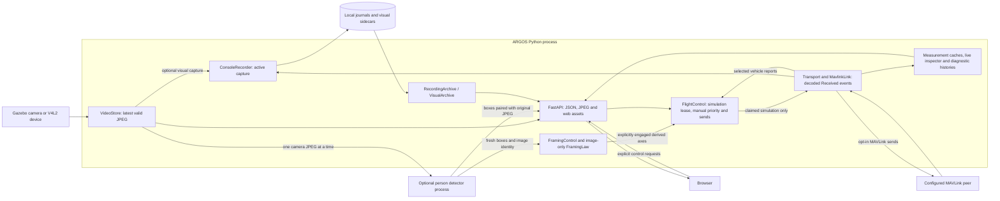
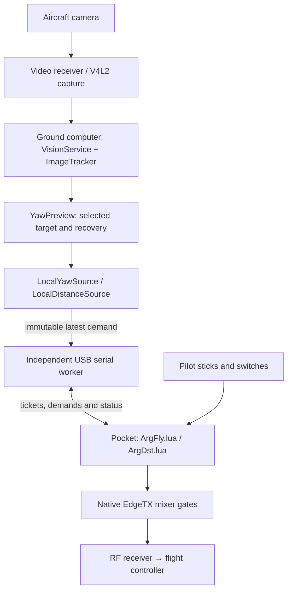

# Architecture

[Documentation](README.md) · [Project overview](../README.md)

ARGOS runs on a ground computer. Its local console combines camera reception,
person detection, recording and replay. Optional control paths connect it either
to ArduPilot SITL through MAVLink or to a physical aircraft through a Pocket
radio. Those paths have different authority and failure rules; the default
console is passive.

This document describes the implemented software, not a claim that every current
configuration has flown. The [validation record](validation.md) separates
automated checks, recorded demonstrations and remaining hardware work. For setup,
start with the [documentation index](README.md).

## Runtime and data flow

The console entry point, `python -m argos.console`, starts one Python process
with FastAPI/Uvicorn on `127.0.0.1`. That process serves the browser assets, owns
the configured receivers and manages the local recording directory. It starts
without sources unless they are explicitly configured. With `--vision-model` or
`--vision-bundle`, a separate spawned inference process receives camera JPEGs
and returns image-space detections; it has no command transport.

| Runtime | Entry point and control boundary |
| --- | --- |
| Observation and replay | `python -m argos.console`; configured sources are passive unless simulation control is explicitly enabled. Replay needs no running camera, radio or simulator. |
| Simulation control | `--sim-control`, optionally `--sim-framing`; `FlightControl` owns a browser lease and sends MAVLink to loopback SITL. |
| Physical yaw assistance | `python -m argos.fly`; the ground computer supplies yaw demands to `ArgFly.lua` on the Pocket. Pilot throttle, roll, pitch and arming remain manual. |
| Physical apparent-distance experiment | `python -m argos.distance`; a separate `ArgDst.lua` model can add bounded pitch from apparent target size. Throttle, roll and arming remain manual. |

FLY and DST validate their saved configuration, detector and local radio-profile
artifacts before starting the shared console and their own serial worker. They
do not configure a MAVLink connection to the physical aircraft. Local artifact
hashes identify files; they do not verify which model or script is installed on
the radio. Their `--check` mode opens no devices or listener.

In the reference simulation, Gazebo and ArduPilot SITL run as separate processes.
ARGOS subscribes to a Gazebo camera topic and reads a MAVLink connection to SITL;
the server does not launch or supervise either simulator. The separate
[`run_web_control.py`](../examples/run_web_control.py) example supervises an
isolated Gazebo, SITL and console session for manual flight. A Linux V4L2 device can replace
the camera source. Camera and telemetry connections have independent lifecycles.

The shared observation path and optional **simulation** control path are:

```mermaid
flowchart LR
    camera["Gazebo camera or V4L2 device"]
    peer["Configured MAVLink peer"]
    disk[("Local journals and visual sidecars")]
    browser["Browser"]
    vision["Optional person detector process"]
    subgraph server["ARGOS Python process"]
        video["VideoStore: latest valid JPEG"]
        link["Transport and MavlinkLink: decoded Received events"]
        state["Measurement caches, live inspector and diagnostic histories"]
        recorder["ConsoleRecorder: active capture"]
        archive["RecordingArchive / VisualArchive"]
        api["FastAPI: JSON, JPEG and web assets"]
        pilot["FlightControl: simulation lease, manual priority and sends"]
        framing["FramingControl and image-only FramingLaw"]
    end
    camera --> video
    video -->|"optional visual capture"| recorder
    peer --> link
    link --> state
    link --> recorder
    recorder --> disk
    disk --> archive
    video --> api
    video -->|"one camera JPEG at a time"| vision
    vision -->|"boxes paired with original JPEG"| api
    vision -->|"fresh boxes and image identity"| framing
    framing -->|"explicitly engaged derived axes"| pilot
    state --> api
    archive --> api
    api --> browser
    browser -->|"explicit control requests"| api
    api --> pilot
    link -->|"selected vehicle reports"| pilot
    pilot -->|"claimed simulation only"| link
    link -->|"opt-in MAVLink sends"| peer
```

The arrows show the main data paths. Browser POST requests configure or reopen
receivers and start or stop recording. These actions send no MAVLink messages.
With `--sim-control`, a separate control path calls the transport's `send()`
method for pilot input, GCS heartbeat, parameter/status requests and explicit
mode/arming actions. Disabled or unclaimed simulation control is passive. The
MAVLink journal records decoded inbound events; optional visual sidecars
separately retain sampled control state and discrete operator requests.

### Physical camera and Pocket radio

The physical path uses a V4L2 capture device on the ground computer and USB serial
to the Pocket. Aircraft video and the radio control link remain separate:

```mermaid
flowchart TB
    aircraft["Aircraft camera"] --> capture["Video receiver / V4L2 capture"]
    capture --> vision["Ground computer: VisionService + ImageTracker"]
    vision --> selected["YawPreview: selected target and recovery"]
    selected --> source["LocalYawSource / LocalDistanceSource"]
    source -->|"immutable latest demand"| worker["Independent USB serial worker"]
    worker <-->|"tickets, demands and status"| pocket["Pocket: ArgFly.lua / ArgDst.lua"]
    pilot["Pilot sticks and switches"] --> pocket
    pocket --> gates["Native EdgeTX mixer gates"]
    gates --> rf["RF receiver → flight controller"]
```

[`LocalYawSource`](../argos/console/yaw_source.py) and
[`LocalDistanceSource`](../argos/console/distance_source.py) publish from the
console event-loop owner after each tick. They validate image/source identity and
deadlines before replacing one immutable mailbox sample. The radio thread reads
that sample without calling inference, HTTP or the console session. Radio target
selection requests return to the owner through a bounded pending request. A
stalled owner cannot refresh a demand's original image deadline.

[`YawAssistService`](../argos/console/yaw_assist.py) and
[`DistanceAssistService`](../argos/console/distance_assist.py) own the serial
worker and bounded diagnostic logging. The corresponding backend streams use
distinct V3 greetings and radio-issued tickets; new images can trigger sends at
up to 20 Hz, with 10 Hz refreshes while a command remains fresh. The Pocket's
300 ms ticket lease and native mixer gates are separate from the host's image
and source-health checks. The standalone yaw bridge retains its HTTP source;
the integrated launchers use the mailbox path above.

The pilot enables assistance and selects/reselects a target through the radio.
FLY latches deliberate yaw takeover until a new SC cycle. DST gives yaw and pitch
independent temporary stick priority, with fresh-ticket resumption after
recentering; SC middle requests persistent manual control. Target loss, expired
images or protocol faults withdraw correction rather than supplying predicted
commands. FLY/DST do not inherit the simulator's browser lease or automatic Land
path. Exact thresholds and receiver checks belong to the [FLY](argos-fly.md),
[DST](argos-distance.md) and [radio-stream](edgetx-yaw-stream.md) guides.

Yaw uses horizontal image offset. DST's
[`ApparentDistanceLaw`](../argos/guidance/apparent_distance.py) uses target-box
height relative to an explicitly captured reference. Neither measures metric
range, position or altitude. Radio ACKs and Lua reports are not measurements of
native mixer output or aircraft response.

## Ownership and scheduling

[ConsoleSession](../argos/console/session.py) is the live runtime owner. It binds
the source configuration, monotonic clock, MAVLink link, measurement caches,
camera store, recorder and diagnostic histories. [app.py](../argos/console/app.py)
assembles the application and ties resource startup and cleanup to its lifespan.

| Work | Owner and execution context |
| --- | --- |
| MAVLink polling, measurement admission, live histories and capture writes | `ConsoleSession.tick()`, called by one asyncio task in the server event loop. |
| Optional simulation control | `FlightControl` receives selected vehicle reports; the same session tick checks lease expiry and transmits current pilot inputs. HTTP mutations run on that event loop. |
| Gazebo images | Subscription callbacks publish into the thread-safe `VideoStore`. |
| Optional person detection | App-owned `VisionService`, serviced by `ConsoleSession.tick()`, submits bounded work to a spawned OpenCV process. Results and short-lived image-space associations are consumed without waiting on inference. |
| Optional visual framing | `FramingControl` owns target selection, freshness and takeover; `FramingLaw` updates derived axes on distinct analyzed images. `FlightControl` retains authority and the MAVLink send boundary. |
| Physical assistance | The event-loop owner publishes `LocalYawSource` or `LocalDistanceSource`; an independent serial thread services the Pocket. Diagnostic logging uses a separate bounded worker. |
| V4L2 images | One worker thread owns the device reader and publishes into `VideoStore`. |
| Visual and filming capture | The session samples replay state; camera and radio observers enqueue filming data. Separate bounded writers perform sidecar disk I/O. |
| Recording verification, indexing, replay and analysis | Archive calls run through `asyncio.to_thread`; a lock protects the shared archive cache. |
| Receiver reopening | Blocking replacement work runs in a thread; the session retains ownership until replacement or cleanup finishes. |
| Display state, selected panels, filters and replay cursor | JavaScript in the browser; these do not own the receivers. |

The receive task waits 10 ms between ticks while vision is configured and healthy,
or 50 ms without it. This promptly collects completed analyses while respecting
the configured analysis ceiling: five per second for the plain console, ten for
FLY/DST, with `--vision-hz` accepting one to ten in the console. Each link poll
limits its read work; neither interval is a guaranteed schedule. MAVLink journal
writes are synchronous in the tick, so slow storage or CPU work can delay
reception. Sidecar queues and the serial worker do not make the application
hard real-time or guarantee lossless capture.

Camera conversion runs outside the store's short reader lock. The store retains
one valid JPEG instead of a frame queue, so an old queue cannot accumulate inside
ARGOS while the browser falls behind. Camera drivers may still buffer frames.

### Simulation lease and framing

Each lease starts unprepared. The pilot selects AltHold or Stabilize and prepares
that mode while disarmed with a fresh landed report and neutral input. Arming
requires observed preparation, the checked profile and zero manual throttle.
AltHold maps vertical input to climb/descent; Stabilize maps explicit throttle
to pilot gas and retains it when a direction is released. Neither holds position.

With `--sim-framing`, explicit airborne engagement uses server-owned detection
boxes for yaw and apparent-height assistance. The `full` profile requires AltHold
and also requests vertical centering. The `pilot_throttle` profile requires
Stabilize: both the law and lifecycle output boundary enforce zero derived
vertical input, while `FlightControl` retains the latest explicit pilot throttle.
Manual attitude input stops either profile; Stabilize throttle changes preserve
assistance and do not acknowledge a target-loss takeover. Those changes still
invalidate stale mode-transfer input evidence. Firmware-mode switching clears
framing and requires explicit reselection/engagement afterward. Neutral browser
keepalives preserve authority but do not overwrite derived axes or acknowledge
target loss. An isolated missing or
low-confidence detection zeros corrections and permits same-ID recovery within
an absolute 600 ms pause. Expiry or other invalid observations latch a two-second
takeover deadline; no manual acknowledgement invokes the existing
landing/revocation path. Image-provider
failures cannot terminate manual/control servicing. The
[framing guide](framing.md) details intent/revision ordering, profile checks and
the absence of position, depth or metric range in the controller.

The browser sends current axes and throttle at 10 Hz with one input request in flight; the
service sends MANUAL_CONTROL at most every 50 ms while its lease is active and
the vehicle is not in the requested landing phase. A lease expires after 0.65 s
without valid input, on the next tick, and cannot be revived by an old token.
Release attempts a neutral attitude input and Land request when armed or when
arming is uncertain, then stops periodic input and GCS heartbeat. A Stabilize
handoff retains the last throttle for that one input until Land takes over. The
pinned SITL profile's GCS failsafe is a separate process/link-loss mechanism:
its 2 s deadline precedes the 3 s RC override expiry, so loss of the process does
not first restore the simulator's low underlying RC throttle. Explicit Land also
stops GCS heartbeat immediately, so browser updates cannot inhibit that fallback
after a refused or unconfirmed command. Only a new ground preparation resumes
pilot transmissions. See
[web-control.md](web-control.md) for the profile checks and their limits.

### Vision and selected-target continuity

[`VisionService`](../argos/console/vision.py) bounds inference to one submitted
image at a time and pairs each accepted result with its original JPEG. Source
replacement resets the live [`ImageTracker`](../argos/perception/image_tracks.py)
association; an old worker result cannot become a fresh image for a new source.
Detection, short-lived track IDs and explicit target selection are separate
steps. A box or local ID does not establish a person's real-world identity.

Official YOLOX Tiny/Nano/S weights have pinned sizes and hashes. An explicitly
selected [custom Nano bundle](custom-vision-models.md) supplies a manifest,
weights, class mapping and matching preprocessing/output contract. Startup
verifies the bundle and probes its graph; invalid custom inference does not
silently fall back to official weights. FLY/DST default to official Nano with
four CPU inference threads. Model loading does not enable another tracker or
change the radio gates.

For physical assistance, [`YawPreview`](../argos/console/yaw_preview.py) owns
the selected target and its recovery state. Its continuous mode can retain a
reference for up to three seconds of detection loss while images remain fresh,
without issuing a correction for the missing target. A replacement track needs
unique compatible appearance/geometry and two distinct qualifying images;
ambiguity or expired memory requires a new selection. This production path is
separate from the offline alternative trackers and recovery prototypes below.

## From received bytes to displayed measurements

[MavlinkLink](../argos/backends/mavlink/link.py) frames and decodes the explicitly
configured UDP, TCP or serial stream using the `ardupilotmega` dialect. UDP
datagrams must contain complete frames; TCP and serial retain partial frames
between polls. A decoded `Received` event contains the original frame bytes,
fields, source identifiers, message type, sequence and local receipt timestamp.

Each decoded event reaches the recorder and live inspector **before** measurement
admission. This separates three responsibilities:

1. **Wire decoding** checks whether bytes form a known, CRC-valid MAVLink frame.
   Corrupt bytes are counted but do not become journal events. An unsupported
   message ID closes the link because its frame cannot be validated with the
   configured dialect.
2. **Inspection and capture** retain traffic from all decoded sources, including
   message types that the measurement display does not use. The live inspector
   keeps the latest frame per source/type; a journal keeps successive frames
   while capture is active.
3. **Measurement admission** selects the configured system/component and checks
   supported fields. A rejected value does not overwrite or refresh the last
   valid measurement. Its decoded frame remains available for diagnosis.

[TelemetryCache](../argos/backends/mavlink/telemetry.py) handles `HEARTBEAT`,
`ATTITUDE` and `LOCAL_POSITION_NED`.
[HealthCache](../argos/backends/mavlink/health.py) extracts battery information
from `SYS_STATUS`; its name does not imply a complete assessment of vehicle
health. [views.py](../argos/console/views.py) shares measurement presentation
between live observation and replay. It also converts non-finite values and
integers outside JavaScript's safe range to explicit strings for raw inspection,
without changing the recorded frame bytes.

Sequence statistics reuse [harness/link.py](../argos/harness/link.py). Their
channel or component scope must match the encoder's counter and requires its
complete, unfiltered stream. They describe locally observed traffic under that
assumption, rather than proving a radio-loss rate for arbitrary routed streams.

## Time, freshness and incidents

Live receipt ages use the session's monotonic clock. MAVLink timestamps mark
local processing during a poll; camera timestamps mark callback entry or return
from a device read. A GET request does not create a new reception or refresh an
old value.

Video, heartbeat, battery, attitude and position have independent age limits.
The browser advances ages from the last accepted state using `performance.now()`
and detects a service that has stopped progressing. This prevents a frozen server
response from keeping measurements apparently fresh. Expired video is withheld;
the frame endpoint returns an unavailable response when there is no recent valid
image.

Local receipt time is distinct from camera exposure time, autopilot time and UTC.
Capture metadata uses UTC to identify when a recording began. It does not
synchronize video with telemetry or establish physical sensor latency. Displaying
two configured sources together does not verify that they belong to the same
vehicle.

Two diagnostic paths deliberately stay separate:

- [ReceptionIncidents](../argos/console/incidents.py) groups observed missing or
  stale receptions and waits for sustained recovery. Notices are debounced;
  measurement expiry itself is immediate. Reopening a receiver alone does not
  establish that reception has recovered.
- [StatusTexts](../argos/console/status.py) retains the selected component's
  `STATUSTEXT` reports, alongside the declared state from `HEARTBEAT`. Chunked
  text keeps connection provenance and marks incomplete assembly. These are
  autopilot reports; silence is not an all-clear indication.

## Browser and source lifecycle

The frontend is packaged HTML, CSS, JavaScript and local fonts. It needs no build
server or CDN. The JavaScript is split by workflow:

| File | Responsibility |
| --- | --- |
| [app.js](../argos/console/static/app.js) | Observation shell, state/image polling, source controls, capture, physical-assistance display and Demo view. |
| [live.js](../argos/console/static/live.js) | On-demand MAVLink inspection and display freezing. |
| [sessions.js](../argos/console/static/sessions.js) | Recording catalog, replay, cursor playback and paginated raw messages. |
| [analysis.js](../argos/console/static/analysis.js) | Historical reception curves, gaps and analysis filters. |
| [control.js](../argos/console/static/control.js) | Mouse/touch/keyboard input, explicit lease ownership, serialized input requests and release on loss of browser context. |
| [framing-report.js](../argos/console/static/framing-report.js) | Recorded visual-framing report and links into the replay cursor. |

State, images and inspection data use separate HTTP requests. Freezing a view or
leaving a tab changes browser behavior; the server continues receiving and an
active recording continues until it is stopped or reaches a closure condition.
Simulation control has a different lifecycle: leaving Flight controls, losing focus or
hiding the page releases its lease rather than continuing to pilot in the
background. Flight controls reuses Observation's camera instead of opening a second
video subscription.

Physical FLY/DST selection belongs to the server and radio, so changing tabs or
closing the browser does not release it. [Demo view](demo-view.md) is a read-only
presentation of that path, with recording controls. Its axis indicators use
correlated Pocket `AP1` observations, including independent validity and phase
per axis. They describe pilot sticks and Lua-reported corrections, not the
flight controller's applied output. Its recent history is browser memory;
filming logs are retained independently.

Independent requests can complete after their context has changed. The frontend
checks session and receiver identities (`run_id`, video `source_id`, MAVLink
`connection_id`), and uses request counters and cancellation to discard outdated
responses. Historical views also bind requests to a journal revision. An image
from the previous camera or a reply for an earlier selection must not replace the
current view.

[ConsoleConfig](../argos/console/config.py) validates a source configuration
before replacement. A full replacement creates a new session; reopening one
receiver keeps the session and changes that receiver's identity. Configuration
changes and MAVLink reopening are blocked during capture. Camera reopening is
allowed: it creates a new video source identity, clears physical target selection
and reattaches an active filming observer to the new store. Sidecar images retain
their source identities. If a V4L2 reader has not released its device,
replacement refuses to start a second reader.
When simulation control is enabled, source replacement also requires released
controls and confirmed disarming. Same-source MAVLink reopening requires the
lease to be released, preserves armed/uncertain flight evidence and resumes
passive reception; fresh receipts and a new explicit claim are required to fly.

The server is intended for local use, with SSH forwarding for remote access.
Mutating endpoints require JSON and the matching local Origin. This deployment
has no multi-user authentication layer; see [running.md](running.md) for the
supported access pattern.

## Journals and historical views

[ConsoleRecorder](../argos/console/recording.py) owns at most one active recording.
The default directory is `~/.local/share/argos/recordings/`, or
`$XDG_DATA_HOME/argos/recordings/` when that variable is absolute. A CLI option can
override it. Recordings use unique identifiers and are created without
overwriting existing files. Storage is local JSONL, optional SQLite visual
sidecars and filming files; no external database or cloud service is required.

| Artifact | Recorded evidence |
| --- | --- |
| `<id>.jsonl` | Capture context, decoded inbound MAVLink frames when configured, and journal completion. It contains no video or outgoing MAVLink commands. |
| `<id>.visual.sqlite3` | Optional sampled JPEGs, paired detections, simulation-control snapshots and console/operator events for visual replay. Sampling is capped at 10 Hz. |
| `<id>.flight/` | Optional physical-camera take: original capture JPEGs in `camera.mjpeg`, a timestamp/provenance index, manifests and radio/vision observations. |

A recent physical-camera image can support a take without a MAVLink source.
Starting or stopping recording does not arm, select a target or enable
assistance. The three artifacts have separate completion and loss indicators;
a complete JSONL journal does not imply complete visual or filming data.

### MAVLink journals

The [recording format](../argos/backends/mavlink/recording.py) stores original
frame bytes and local timestamps in JSONL. Version 2 added capture context;
version 3 adds an explicit closure reason. Console captures use version 3 with
validated source context, and readers retain support for versions 1 and 2.
The end record, event count and
checksum make a completed journal distinguishable from a truncated capture.

Transport failure, a capture limit and graceful shutdown can all produce a
properly closed journal with the corresponding reason. A completed file does
not imply an uninterrupted session. An abrupt process kill or a write failure
can leave an incomplete file; the archive rejects it rather than presenting it
as a valid recording.

[RecordingArchive](../argos/console/archive.py) lists candidate files cheaply,
then validates the entire journal before exposing its contents. Validation covers
structure, timestamps, frame decoding, completion, count, checksum and file end.
A SHA-256 revision binds metadata, replay, analysis, message pages and download
to the same contents. Changed revisions are rejected, and downloads return the
validated bytes. Integrity checks detect corruption; they do not authenticate
the sender or file author.

Replay indexes the admitted measurements for a selected source and evaluates
their age at the recorded cursor time. Moving backwards uses the index, never
the current live caches. Missing values remain missing, and historical values
can become stale; there is no interpolation. Known capture context supplies the
original freshness limits. Older files without that context use explicitly
identified analysis defaults.

[analysis.py](../argos/console/analysis.py) computes receipt rates, ages and gaps
from recorded events. The raw-message view exposes successive decoded frames,
including ones not admitted as measurements. The JSONL journal does not persist
the console's derived incident history. Received `STATUSTEXT` frames are included
while recording, but the live assembled history is in memory.

### Visual replay and filming

[`VisualRecorder` and `VisualArchive`](../argos/console/visual_recording.py)
store and reopen the sampled SQLite sidecar. Capture observes existing images
and state without rerunning inference or control. The archive checks the
recording/run/start-time binding and visual revision; JPEG hashes bind retrieved
frames to the saved bytes. Replay shows recorded observations at the cursor,
including gaps, and cannot send commands. The [bundled flight replay](../examples/demo-flight/README.md)
is a simulation recording, distinct from the physical-flight portfolio media.

[`FilmingCapture`](../argos/console/filming.py) attaches observers to the existing
camera store and radio service. [`CameraRecorder`](../argos/console/camera_recording.py)
writes admitted capture JPEGs before browser overlays, without opening another
camera or encoding another JPEG. Its frame index supplies the actual receipt
intervals; an MJPEG player's assumed frame rate is not the recording clock.
Separate queues report drops and write failures instead of blocking producers
on disk. They do not guarantee that every received image will be retained.

Filming events include radio-status/pilot observations and image-bound vision
results. `AP1` supplies calibrated pre-mix sticks and Lua outputs, not native
channel readback or FC telemetry. Repeated reports preserve original receipt
times. A bracketed clock anchor relates host radio timestamps to console time;
neither clock measures camera exposure or physical response. Run diagnostics and
the filming take are separate logs, with separate sampling and overflow limits.
The [filming guide](filming.md) defines the files, completeness checks and export
workflow.

## Retention and limits

Limits keep retained state and exposed files bounded. They are not a cap on total
process memory: decoding, conversion, requests and indexing also allocate memory.

| Data | Current policy |
| --- | --- |
| Camera | One retained valid JPEG; dimensions and raw/encoded sizes are checked by [video.py](../argos/console/video.py). |
| Live inspector | Latest frame for up to 256 source/type identities by default; bounded time buckets estimate rates. Evicted identities lose their retained counters. |
| Diagnostic histories | Up to 60 session events and 60 status-text entries by default, with separate bounds for pending text assembly. |
| MAVLink capture | At most 100,000 events and 32 MiB; space is reserved for finalization, so closure can occur before the byte limit. No automatic next segment. |
| Visual replay | At most 256 MiB, 36,000 samples, 20,000 events and one hour; bounded writer queue, at most 10 samples/s. |
| Filming camera | Defaults to 30 minutes, 2 GiB and 216,000 images; pending/in-progress images are bounded to 128 and 64 MiB. |
| Filming events | At most 128 MiB and 200,000 events, with a 4 MiB queue bound. |
| Archive | Catalog shows up to 200 most recently modified candidates; one validated file and one source replay index are cached. |
| Historical responses | Raw messages are paginated; analysis limits the number of bins and detailed gaps. |

MAVLink write and archive limits share [recording_limits.py](../argos/console/recording_limits.py),
so the console does not intentionally create a completed journal larger than it
can reopen. Reaching a recording limit stops capture while live observation
continues. Existing files survive restarts; live counters, incidents and browser
selections are not a durable session database. Limits apply per file, with no
automatic deletion policy for accumulated recordings. Sidecar status must be
checked separately when a queue, duration or storage limit is reached.

## Experimental packages and integration boundary

The console composes detection, laws and transports; individual packages retain
narrower responsibilities:

| Package | Current role |
| --- | --- |
| [core](../argos/core/) | Typed observation, command, `World` and `Truth` contracts for experiments. |
| [perception](../argos/perception/) | `yolox.py`, `model_bundle.py`, `image_tracks.py` and appearance utilities support live detection/association. Alternative trackers and recovery policies are available to offline experiments. Perception does not import guidance or backends. |
| [guidance](../argos/guidance/) | `image_framing.py` supplies simulation framing; `apparent_distance.py` supplies DST's image-height law. The console owns their activation and lifecycle. |
| [safety](../argos/safety/) | Validation, gate and envelope contracts used by the experimental core. This package is not the live aircraft's safety controller. |
| [backends](../argos/backends/) | MAVLink/EdgeTX transports, radio-profile tooling, immutable demand contracts and experimental simulators. `DistanceDemand` carries data; console-owned `DistanceValidator` invokes the distance law. |
| [attitude_sim.py](../argos/backends/attitude_sim.py) | Simulated backend used to exercise those contracts. |
| [harness](../argos/harness/) | Link statistics reused by live MAVLink, plotting, and offline continuity/multi-person orchestration that combines perception, console selection and dry command admission. |

The MAVLink transport is not an implementation of `World`. The console does not
run a general navigation loop, and the presence of a `safety` package does not make it a
vehicle safety controller. Experimental `World.time()` belongs to its backend;
the live console clock is not a shared clock for every package or machine.

The [offline continuity tools](continuity-diagnostics.md) can replay saved
detections and images through target selection and dry yaw admission. ByteTrack,
BoT-SORT and the motion/duplicate/candidate recovery prototypes are comparison
paths, not the tracker or recovery policy enabled by FLY/DST. The BoT-SORT
comparison does not enable learned ReID. A result on reused recordings or
synthetic scenarios is not live integration or independent flight validation.

`harness/continuity_replay.py` and `harness/multi_person_scenarios.py` own that
cross-layer orchestration. [`continuity_provenance.py`](../argos/harness/continuity_provenance.py)
verifies saved source dependencies, including the exact historical relocation
of replay from `perception` and the corresponding two runner substitutions.
It does not generally waive changed-source hashes; new reports bind current
paths and bytes. [Dense validation](continuity-validation.md) describes that
compatibility and the limits of reviewed references.

The observation path remains usable without running these experiments. ARGOS
perception and guidance run on the ground computer; onboard deployment, a new
custom MAVLink dialect and swarm coordination are outside this runtime.

## Verification map

| Boundary | Automated coverage |
| --- | --- |
| Package dependencies | [Core isolation tests](../tests/test_core_isolation.py) reject prohibited imports between perception, laws and backends. |
| MAVLink and simulation control | Transport/journal tests check decoding, completion and replay; controller/API tests check expiry, command evidence and simulation-only restrictions. |
| Physical assistance | Source, stream, native-profile and Lua tests check image identity, tickets, expiry and pilot handoff under software fixtures. They do not measure RF or aircraft response. |
| Vision and offline experiments | Model-contract, association, continuity and provenance tests check declared inputs, deterministic scenarios and rejection of altered evidence. |
| Recording and browser | Tests cover sidecar bounds/completion, replay, filming loss reporting, delayed responses, control lifecycle and Demo view evidence. Browser fixtures use synthetic camera/radio data. |

The [current verification record](validation.md#current-verification) gives dated
suite and CI evidence, prerequisites and physical limitations. Counts describe
the tested revision, not every later checkout. Use the
[README](../README.md#verify-a-change) for commands and the
[SITL guide](sitl-observation.md) for the integrated simulator setup.
