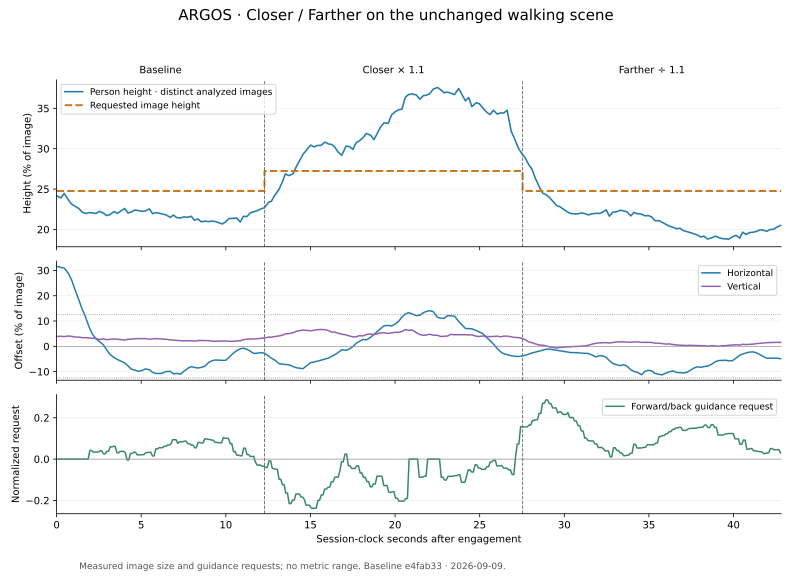

# Environment and validation

The published V1 corresponds to package version **0.1.0**, with passive
observation and recorded-session analysis. The working tree additionally contains
the opt-in [manual web flight](web-control.md) and [camera perception](vision.md)
milestones verified below; no new release is implied. This page separates automated, simulator and hardware evidence.

## Automated checks

[CI](../.github/workflows/ci.yml) defines three jobs on Ubuntu 24.04:

| Job | What it checks |
| --- | --- |
| Python 3.12 | The pytest suite: contracts, simulation, local transports, measurement validation, captures, archives and API. The bundled SITL example is also verified. |
| Browser, Node.js 22 | Playwright workflows in Chromium, using a local file server and test responses. No dependency on a simulator or an existing console. |
| Installed package, Python 3.12 | Wheel build, installation in a separate virtual environment, CLI, HTML/CSS/JS, fonts and state with no source configured. |

The wheel job runs `scripts/smoke_installed.py` with `python -I` and checks that
the module comes from `site-packages`. This detects issues such as missing
packaged assets that an editable installation could hide. The smoke test makes
in-memory HTTP requests without opening a network server, camera or MAVLink link.

Transport tests use localhost UDP/TCP and a POSIX serial pseudo-terminal.
Simulated faults remain in tests. They do not replace validation of radio
hardware, a camera driver or an actual flight.

## Installation and versions

Local preparation verified a wheel build and a non-editable installation in a
fresh Python 3.12 virtual environment, separate from the development environment.
Imports, `python -m argos.console --help`, web assets and `pip check` all passed.
The package includes frontend assets and font licenses.

Direct MAVLink, console and plotting dependencies are pinned in
[pyproject.toml](../pyproject.toml). NumPy, pytest, the build tool and transitive
dependencies are still resolved by pip. The repository therefore does not
promise an identical binary environment on every installation. The tested
environment is Ubuntu 24.04 x86-64/Python 3.12; declaring Python ≥3.11 does not
amount to validating a full platform matrix.

## SITL and camera trial

The ground trial on September 7, 2026 received the Gazebo sensor and ArduPilot
TCP stream simultaneously. The [guide](sitl-observation.md) provides both full
revisions, model changes and exact parameters. The reference binary identifies
itself as ArduCopter-ARGOS 4.8.0-dev `8927564c`; the observed Gazebo libraries are
Sim 8.13.0, Transport 13.5.0 and Msgs 10.3.2.

The supplied patch was verified against copies of the upstream files at the
documented revision. The setup guide follows official instructions; a complete
system installation and rebuild from a fresh machine were not repeated for this
V1. Headless rendering depends on the machine's graphics support even when no
Gazebo window is open.

The [example recording](../examples/demo/README.md) is a separate historical
extract. Its frames and checksum are verified; the older format does not record
the exact UTC date, firmware or capture configuration. The manifest does not
infer those details from the current trial.

## Manual web flight trial — September 8, 2026

The opt-in simulation milestone was checked on the same Ubuntu 24.04/Python
3.12 host and pinned ArduPilot/Gazebo installation:

- **1,161 Python tests passed**, including lease deadlines, command evidence,
  input bounds, source restrictions and passive recovery after link loss. The
  final profile uses the pinned firmware’s renamed speed/tilt parameters in m/s
  and degrees; their received values are required before arming.
- **32 Chromium browser tests passed** (17 existing and 15 new), including real
  Chromium touch pointer events, combined axes, capture loss, hidden tabs and
  responsive layouts. Laptop, tablet and phone layouts were visually inspected.
- A newly built wheel was installed in a separate clean virtual environment.
  Isolated imports, CLI help, packaged assets (including the control panel),
  passive initial state and `pip check` passed.
- An isolated Gazebo/SITL flight used the supplied GPS-free profile with normal
  arming checks. Through the actual HTTP service, claim, AltHold preparation,
  arming, climb, yaw input, Land mode and automatic disarming were observed.
  Both GPS receivers and compass yaw use were disabled; no flow, marker,
  rangefinder or visual-position source supplied navigation.
- The real browser then exercised the complete path without mocked endpoints:
  touchscreen input generated via Chromium's device protocol held **Climb**,
  produced a climb in reported barometric local altitude, released
  to neutral, requested Land and reached confirmed disarming. The Gazebo camera
  remained visible. This is not a physical-tablet test.
- Stopping browser input during a simulated flight expired the lease, requested
  Land and ended with observed landing/disarming; no browser action regranted
  control automatically.
- Suspending the console process during another flight stopped its transmissions.
  A separate receive-only MAVLink connection observed Land while the console was
  still suspended, confirming ArduPilot's GCS failsafe without a backend landing
  request. After resuming reception, landing and disarming were confirmed.

The simulator ran below real-time speed while another Gazebo instance was active.
Wall-clock button duration is therefore not a calibrated flight-time measurement.
The final complete profile was read back from SITL: every configured name was
present and its value matched, including the speed/tilt settings.
The recorded altitude is autopilot telemetry, not an independent accuracy
measurement. These trials demonstrate simulated manual control, not reliable
position holding, target following, or physical-aircraft readiness.

## Stabilize manual-throttle trial — September 8, 2026

The next manual-control milestone used the same pinned installation, with a
fresh launch of the supplied GPS-free profile:

- **1,226 Python tests passed**, including explicit preparation per lease,
  ground-only mode selection, zero throttle before arming, input validation,
  source recovery and the single manual-input handoff to Land. Tests also cover
  refused, missing and failed Land commands: ongoing browser updates cannot
  keep GCS heartbeat running and suppress the autopilot fallback.
- **46 Chromium browser tests passed**, including retained manual gas after
  releasing a direction, real Chromium touch events combining gas adjustment
  with a held direction, ground mode selection and lifecycle resets. Laptop,
  tablet and phone layouts were inspected. These are not physical-tablet tests.
- A newly built wheel passed installation into a fresh environment, isolated
  CLI/import checks, packaged mode/throttle assets, passive default-state checks
  and `pip check`. The offline recording example verified its 58 frames.
- Through the real browser and HTTP service, Stabilize preparation and arming
  were confirmed at **0% manual gas**. A touch-set **57% pilot input** produced
  a climb in reported local altitude; releasing a yaw control retained that gas.
  Received RC channel telemetry also reflected the throttle input. Land and
  automatic disarming completed, followed by a new lease and successful AltHold
  climb/landing. No mocked control endpoint was used for these flights.
- In another Stabilize flight, stopping browser inputs expired the lease and
  ended in Land and confirmed disarming, with stored throttle reset to zero.
- Suspending the console during a separate Stabilize flight stopped all of its
  transmissions. A receive-only MAVLink connection observed Land while the
  console was still suspended; reception after resuming confirmed landing and
  disarming. The observer sent no GCS heartbeat or pilot commands.
- All **39 configured profile parameters** were read back and matched. The
  profile now sets RC override expiry to **3 s**, after the **2 s** GCS Land
  timeout, so loss of the service does not first restore low underlying RC gas.
  Explicit Land also stops GCS heartbeat until a new ground preparation.

Throttle percentage represents normalized pilot input, not measured thrust or
a calibrated vertical speed. Stabilize does not regulate altitude; neither mode
holds horizontal position. These trials use autopilot telemetry and below-real-time
simulation, not an independent position-accuracy measurement. They do not validate
in-flight mode transitions, physical flight, visual following or a metric range
estimate. No GPS, downward flow, marker or external visual-position input was used
for flight control.

## English interface — September 8, 2026

The interface now uses English throughout Observation, Flight controls, Live
MAVLink, Sessions, source settings, accessible names and service-generated
status/error messages. Numbers and dates use the explicit `en-US` locale.
Autopilot payloads and existing recordings retain their original content.

The complete **1,226 Python tests and 46 Chromium browser tests passed** with
English expectations. Existing control, touch, lifecycle, source-recovery and
recording checks were retained. Desktop, tablet and phone layouts were inspected;
a freshly built installed wheel passed its resource and passive-state smoke
checks. HTML structure and identifiers were preserved, and Python syntax-tree
comparison confirmed that changes outside documentation were string values.
No flight-control algorithm, protocol field or recording format changed, and
this language update did not repeat the earlier flight trials.

## Remaining limitations

- The V4L2 adapter exists, but it still needs validation on the chosen hardware.
- No onboard radio video transport is provided; physical camera input is local.
- Simulation tests for the other modules do not connect them to a real autopilot.
- CI does not run flights, hardware deployments or a complete Gazebo simulation.
- The first GitHub Actions result will only exist after the first push; having a
  workflow file does not mean it has already run on GitHub.

## Camera person detection and tracking — September 8, 2026

The optional [vision milestone](vision.md) was checked on the pinned Gazebo/SITL
installation, using the actual onboard camera, an ordinary animated person and
the unmodified official YOLOX-Tiny ONNX model. The person scene keeps the declared
1.2-radian camera HFOV fixed: the upstream zoom plugin otherwise changes it to
2.0 radians during startup. Only the private scene copy removes that plugin;
actor scale, detection confidence and the GPS-free flight profile are unchanged.

- **1,312 Python tests passed**, covering detector decoding, model/asset checks,
  bounded image association, process failure isolation, source replacement,
  matching JPEG/result provenance and expiry, alongside the existing suite.
- **71 Chromium tests passed**, including 25 vision tests for delayed responses,
  switching streams, invalid metadata, stale/service/decode failures, overlay
  geometry and touch layouts. Labels and camera fitting were inspected on
  desktop, tablet and phone viewport sizes. These are browser emulations, not
  physical-device trials.
- The rebuilt wheel passed isolated installation, CLI, packaged vision controls,
  passive defaults, unavailable-image responses and dependency checks. The
  offline MAVLink example still verified all 58 frames.
- A final **40-second ground sample contained 196 unique analyzed frames**.
  Every frame detected the one visible person, with one track ID throughout and
  zero ID changes. Person height ranged from 68 to 100 pixels. Median confidence
  was 0.865; camera receipt age was 159 ms median and 287 ms maximum. CPU network
  inference took 47.6 ms median and 62.9 ms maximum. These are observed values on
  one host running two Gazebo instances, not general accuracy or latency bounds.
- An actual GPS-free AltHold flight through the HTTP service, with vision active,
  completed arming, climbing past 1.7 m of reported local altitude, neutral
  vertical input, a brief yaw input, Land and confirmed disarming. All 136 status
  samples reported recent vision; 135 contained a person detection. These status
  samples are not independent image-level accuracy measurements. No input
  request failed; observed request latency was 1.69 ms median and 5.21 ms maximum.
- Terminating the inference process during a separate disarmed control lease
  produced an explicit vision error while the raw camera advanced and 39
  neutral control input requests succeeded. The optional worker failure did not
  stop MAVLink/control servicing. Automated tests also cover startup/inference
  deadlines and IPC failure containment.

The initial wide-angle trial missed small people in some frames. After fixing
the camera configuration, detections were continuous in the sampled scene, but
strict overlap-only association still changed IDs during lateral walking. A
bounded, mutually unambiguous center/size association fallback removed those
changes in both a replay of the measured boxes and the final live sample above.
No scene coordinates, marker, body-height assumption or predicted detection
filled gaps or corrected model output.

This establishes a camera-based perception baseline during manual simulated
flight. It does not establish reliable identity tracking through crossings or
occlusion, physical outdoor accuracy, automatic centering/following, position
hold or metric range. The animated actor does not physically react to the drone.
Existing journals remain received-MAVLink captures; video and detections are not
recorded or replayed. The eight existing journals were byte-identical after the
trial and deployment.

## Experimental visual framing — September 8, 2026

The opt-in [framing controller](framing.md) connects an explicitly selected
camera detection to bounded AltHold pilot inputs in the isolated GPS-free
Gazebo/SITL session. The detector, confidence thresholds, actor dimensions and
camera optics are unchanged from the vision milestone. No target coordinates,
depth, known body size or simulated position enter the framing law.

- **1,472 Python tests passed** on the supported Ubuntu/Python 3.12 environment.
  They cover image-only guidance, independent output bounds, ownership and
  delayed-intent fencing, manual priority, pause/takeover deadlines, perception
  failure isolation, parameter mapping and paced parameter discovery, alongside
  the complete existing suite. Two existing Starlette deprecation warnings remain.
- **89 browser tests passed** using local Chrome on macOS with one worker,
  including exact displayed-frame selection, touch/focus preservation, delayed
  Engage/Manual requests and explicit pause/resume. Desktop, tablet and phone
  layouts were inspected; these are browser emulations, not tablet hardware trials.
- The rebuilt wheel passed isolated installation, CLI, packaged framing assets,
  disabled-by-default state and dependency checks.
- All **45 required parameters** were received and matched before flight.
  The first attempted startup exposed ArduPilot's bounded parameter-response
  queue: only 20 of the original 45 simultaneous requests received replies.
  Keeping a small initial batch and pacing remaining/missing reads resolved this
  without changing values or bypassing the arming gate.
- An actual HTTP-controlled flight completed manual takeoff and **55.21 seconds
  of framing engagement**, including three observed neutral-pause episodes. The
  25-second initial stage and 20-second Closer stage completed. Farther ran about
  9.93 seconds before an unusable selected-target observation outlasted the pause
  and latched takeover. The script then explicitly requested Land; reported
  landing and disarming completed. The planned 65-second uninterrupted trial
  did **not** pass.
- During that flight, median absolute horizontal centering error was about
  5.3%, 5.2% and 2.2% of image width in the three stages. Vertical medians were
  about 1.2%, 2.1% and 1.2% of image height. Reported estimator altitude stayed
  between 1.02 and 1.07 m, peak pitch was 2.084 degrees and reported horizontal
  speed reached 1.273 m/s. These are sampled camera/telemetry results, not an
  independent ground-clearance measurement or guaranteed performance bounds.
- **Apparent-size regulation did not settle reliably.** Median height/reference
  ratios were 0.932, 0.959 and 0.734; the Closer stage's 5th–95th percentile range
  was 0.686–1.324. These results establish an adjustable experimental objective,
  not accurate distance keeping. The actor keeps walking during each stage.
- A separate real-browser flight used held Climb, clicked Person #4, engaged
  through the actual API and observed **8.16 seconds** of assistance before
  Manual, Land and confirmed disarming/release. Engagement's `input_seq=92`
  was acknowledged after the last nonzero manual input at sequence 77. There
  were no mocked flight responses. Current box height changed from 13.1% to
  16.0% against its 13.1% reference, again showing range-regulation limitations.
- In a separate airborne fault trial, terminating the inference worker just
  after confirmed engagement produced neutral takeover outputs. Continued
  neutral browser traffic did not acknowledge the loss: authority was revoked
  approximately **1.96 seconds after the first sampled takeover state**, then
  Land and disarming were observed without an operator Land request.

Earlier trials stopped on brief confidence/detection gaps or a changed track ID.
A dedicated camera capture contained 291 unique frames, with the same track ID
on all 289 detected frames. Both isolated missing-frame JPEGs visibly contained
an unobstructed person. This justified the explicit 350 ms **neutral-output**
pause: fresh same-ID recovery can continue engagement, with command/derivative
history reset. No old box, predicted detection or lower threshold fills the gap.
A changed ID, stale image or other invalid observation still latches takeover;
a good frame arriving after the pause deadline cannot restore assistance.

Centering is usable in the tested scene, while size regulation and perception
continuity need further work before a dependable following demonstration.
These trials do not validate outdoor following, physical flight, radio/HITL,
VIO, horizontal position hold, obstacle clearance or metric range. Received
MAVLink remains the journal format; visual commands and image history are not
replayed in Sessions. Existing user recordings were preserved.

### Interruption diagnostics follow-up — September 8, 2026

A reported early framing failure left a server error confirming takeover timeout
and an automatic Land request. The browser replaced that cause with either a
generic interrupted-control message or an expired-owner response, depending on
whether state polling or the next input request observed the revocation first.
The original detection failure was not retained and cannot be reconstructed for
that attempt.

Two additional real-browser flights on the unchanged controller each observed
40 seconds of framing after manual takeoff. Neither reproduced a full takeover.
During the higher-takeoff flight, captured images established one empty detection
and one same-ID confidence drop to 0.46984, while the person remained visibly in
the image. Fresh same-ID observations returned in about 0.2 seconds in each case,
so both neutral pauses recovered. The first sampled image ages were 0.082 and
0.073 seconds: these two gaps were not stale-image or changed-ID failures.

The diagnostic correction preserves the first takeover's cause and image
metadata, and keeps the revoked lease's cause visible after a late input error,
Land and disarming. A separate landing outcome remains visible if sending or
confirmation fails. Tracking thresholds, pause/takeover deadlines, guidance and
browser authority are unchanged. These successful short flights do not establish
that the reported intermittent loss is resolved.

Focused verification passed 295 Python checks covering flight control, framing,
API ordering, diagnostics, profiles and guidance, plus 56 browser checks covering
manual/framing controls and both interruption-response orders. These are focused
regressions, not a rerun of the previously reported repository-wide validation.

After deployment, a real-browser ground-only claim/release displayed the server's
retained interruption in both control panels. Camera, vision and vehicle receipts
were recent; the vehicle remained disarmed. All eight existing user recordings
matched their before/after byte sizes and SHA-256 hashes.

### Comparing short detection gaps — September 8, 2026

Two baseline flights reproduced the reported interruption with confidence 0.5
and a 350 ms neutral pause. The first reached about 88.5 seconds of framing;
the higher-takeoff attempt stopped after about 3.4 seconds. Recorded image
metadata identified recoveries on the same ID after about 0.401 and 0.449 seconds.
Visual inspection found the selected person still present in the failure images.

The offline comparison ran the actual framing lifecycle over the same recorded
observations for nine combinations: continuation confidence 0.5/0.45/0.4 and
pause 0.35/0.6/0.8 seconds. Engagement confidence stayed 0.5 in every case.

| Continuation confidence / pause | Short-flight gap | Higher-flight gap |
| --- | --- | --- |
| 0.5 / 0.35 s (baseline) | Takeover | Takeover |
| 0.45 / 0.35 s | Takeover | Takeover |
| 0.4 / 0.35 s | Recovery | Takeover |
| 0.5 / 0.6 s (selected) | Recovery | Recovery |
| 0.5 / 0.8 s | Recovery | Recovery |

The two lowest higher-flight scores were 0.384537 and 0.366753, explaining why
lowering continuation confidence to 0.4 alone did not resolve that example.
The selected change therefore keeps confidence at **0.5** and extends only the
neutral pause to **600 ms**. Staleness remains 450 ms, tracker identity rules are
unchanged, and the subsequent manual-takeover deadline remains two seconds.

The [recorded fixtures and instructions](../examples/data/framing_dropout/README.md)
make the comparison reproducible without starting a simulator or sending flight
commands. These are fixed-path admission replays, not alternative simulated
flights or detector accuracy benchmarks. Availability timestamps are collector
observations; measured poll gaps and execution-phase uncertainty remain relevant
near deadlines. Both fixture windows end at their first recovery before manual
intervention, and never automatically restart a lost engagement.

In the live candidate's higher-takeoff trial, framing stayed engaged for about
**63.5 seconds**, including eight recovered neutral pauses. Recorded recovered
pause durations were about 0.21–0.45 seconds, with approximately 50 ms sampling
uncertainty. All 66 paused state samples had zero derived axes. A later gap still
exceeded the 600 ms deadline; the operator script requested Manual/Land and
confirmed disarming/release. The planned 90-second uninterrupted trial **did not
pass**. Several empty analyzed images followed the final low-confidence result;
a new track ID appeared afterwards. Longer pauses do not provide identity
continuity across that kind of loss.

The candidate's short-takeoff trial also failed its 90-second target: server
timestamps place engagement at **11.71–11.76 seconds** before takeover. One pause
recovered on the same ID after about 0.20 seconds; the final sequence contained
three empty results and then a new ID. All 16 paused state samples had zero
derived axes. Manual/Land, disarming and release were observed again. Across
these two candidate trials, all **82 sampled paused states** had neutral axes;
neither trial completed 90 seconds. Visual inspection of an empty-result image
from each final gap found the person still present. Detection continuity and
track identity remain limitations; extending the pause does not repair them.

The live flights started from different vehicle states, so their durations are
not a controlled speedup or reliability ratio. The paired replay establishes
recoverable short gaps; the flight establishes actual same-ID recovery while
commands are neutral. Reliable long-duration following remains unvalidated.

Focused verification passed **319 Python tests** covering framing lifecycle,
flight control, API ordering, interruption diagnostics, vehicle parameters,
guidance and the offline evaluator. These checks preserve the fixed pause
deadline, independent image freshness, manual priority and subsequent two-second
takeover deadline. This is not a new repository-wide or browser regression run;
the live trials above exercised the actual browser interface. All eight existing
user recordings retained identical byte sizes and SHA-256 hashes. Both consoles
were receiving camera and telemetry; the manual vehicle was left disarmed with
control released and recording idle.

A later idle check found both simulation feeds stale while host RAM and swap
were exhausted; the manual Gazebo process had grown to about 8.7 GiB resident
memory. Restarting only the idle manual simulation restored both feeds and more
than 8 GiB of available memory. The cause of that memory growth remains
uninvestigated; long-duration service operation is not established by the short
flight tests above.

## Optional detector profiles — September 9, 2026

The optional [YOLOX-S 640 profile](vision.md#model-and-data-flow) was compared
offline with the existing YOLOX-Tiny 416 profile on **21 saved camera JPEGs**.
The images came from four September 8 failure neighborhoods: the short and
higher baseline flights, and both later 600 ms-pause candidate flights. They
include eight images where Tiny published no detection, five with a published
box below the 0.5 framing threshold, and eight adjacent detections above it. This is
a deliberately selected difficult sample, not a representative accuracy set.

Both models used the same original pixels, preprocessing convention, person
publication threshold of 0.35, NMS threshold of 0.45 and maximum of 16 boxes.
S changes both network capacity and input resolution; this is not a resolution-only
experiment. Tiny re-inference reproduced all recorded boxes and confidence
values exactly. Neither weights nor thresholds were tuned for these images.

| Model | Images with a box ≥ 0.35 | Images with a box ≥ 0.5 | Images with multiple boxes | Total median / p95 / maximum |
| --- | ---: | ---: | ---: | --- |
| Tiny416 | 13 / 21 | 8 / 21 | 0 | 45.2 / 54.3 / 68.9 ms |
| S640 | 21 / 21 | 21 / 21 | 0 | 166.9 / 192.2 / 256.7 ms |

These wall times were measured on the ground computer with OpenCV 5.0.0, CPU
backend and two threads, while the simulator remained running and grounded.
The models ran serially with two warmup forwards followed by three timed passes
per image: 63 timed observations per model. Total time includes JPEG decoding,
preprocessing, network inference and box decoding; it excludes disk access,
model loading, worker IPC and event-loop publication. The p95 uses sorted sample
index `floor(0.95 × (n − 1))`. Every repeated output was identical. These timings
are broader than the network-only `inference_ms` displayed in the interface.

All 21 original images were visually inspected against the S box coordinates.
Each contained one visible full person, and the S boxes plausibly covered the
person from head through feet; no obviously unrelated or body-part-only box was
found. S confidence ranged from 0.782 to 0.889. This is qualitative pixel review,
without annotated boxes, ground-truth IoU, calibrated confidence or a measured
precision/recall score. Pose-dependent box changes remain relevant to framing.

A separate **nine-image September 9 manual-yaw subset** contained five fully
visible person images during rapid rightward image motion, three visually empty
images after the person left the right edge, and one partially visible person
at that edge. Both models returned six detections and three empty results, with
no extra person boxes. Both detected the partial person, so clipping checks
remain necessary. The S total median / p95 / maximum was **174.2 / 200.9 /
223.6 ms** over 27 timed runs. The fully visible detections accompanied changing
track IDs under rapid image displacement; changing the detector alone does not
repair that association failure. Three empty images do not establish a general
false-positive rate.

The model files' exact sizes, hashes, upstream source and explicit setup/launch
commands are documented in [vision.md](vision.md). The saved JPEGs and raw local
benchmark outputs are not included in the repository, so these numbers document
this evaluation rather than a clone-runnable image benchmark. The checked-in
tests cover both export geometries, model integrity, variant selection and the
worker/configuration path without downloading weights or running inference.

**Tiny remains the default.** S is an explicit option for further ground-computer
evaluation. Its p95 is close to the 200 ms interval of a five-Hz pipeline, and
some calls take longer. One pending image prevents an accumulating queue, but
camera age, IPC and scheduling still contribute to the 450 ms framing limit.
This saved-image result does not establish live S freshness, continuous framing,
identity preservation through crossings or real outdoor performance. It cannot
prove an alternative successful flight: different commands would change later
camera images. No S flight validation is claimed by this offline comparison.

### S CPU thread comparison

A subsequent bounded comparison reran the same verified S model and original
21 JPEGs with two and four OpenCV CPU threads. This measurement was separate
from the table above: the load now included a grounded simulator and the active
S worker in the console. The comparison ran after the current capture finished,
with the vehicle disarmed and control released. No flight commands were sent.

The host reports an Intel Core i5-12400F, one socket, six cores and twelve logical
CPUs with two hardware threads per core; `lscpu` also reports Microsoft full
virtualization. Each setting used two warmups and 63 timed calls, preserving the
same total-time definition and p95 calculation as the earlier comparison.
The two-thread run preceded the four-thread run; changing background load and
run order remain potential timing influences.

| S thread limit | Total median / p95 / maximum | Images with a box ≥ 0.5 |
| --- | --- | ---: |
| 2 | 188.1 / 213.6 / 260.7 ms | 21 / 21 |
| 4 | 123.5 / 132.2 / 141.2 ms | 21 / 21 |

Four threads reduced median total time by about 34% and p95 by about 38% in this
comparison, with a lower observed maximum. Six threads were not tested because
four already met the investigation's target of median below 130 ms and p95 below
160 ms. Those targets guide this benchmark; they are not flight admission rules
or guaranteed execution bounds.

The console and simulation launcher therefore expose the explicit
`--vision-threads` integer option from 1 to 6, preserving the default of **2**.
The configured limit appears in vision status. Frame freshness, detection
thresholds, tracker gates and takeover deadlines are unchanged. Lower network
cost leaves more room for camera receipt age, IPC and event-loop scheduling;
only a subsequent live test can establish the resulting complete image age.

### Live S framing checks

The real console, camera worker, Gazebo and ArduPilot SITL were exercised through
the shipped browser controls, with no mocked detections or injected flight state.
The simulation profile still disabled GPS. The 0.5 framing confidence gate,
450 ms image-age limit, 600 ms neutral detection pause, association gates and
two-second takeover deadline were unchanged.

With S and **two threads**, one engagement was accepted and then latched takeover
for `Selected target image is stale` after approximately 0.23–0.28 seconds,
bounded by the adjacent server snapshots. The lost observation was 468.3 ms old
and still contained the selected ID with confidence 0.855. The requested 60-second
window failed. Manual stop, Land, disarming and release were verified.

Across the complete 115-second capture, 46 of 2,294 state samples (2.0%) contained
an analyzed image older than 450 ms. Sampled age p50 / p95 / maximum was
337.0 / 436.4 / 514.0 ms, with about 4.81 processed images per second. All 554
unique images were first observed before 450 ms: images aged beyond the limit
between subsequent results. `vision.state == recent` alone is insufficient here,
since visual display uses a one-second limit and framing uses 450 ms.

After selecting **four threads**, a separate flight used a 6.5-second held climb,
released manual input, selected the detected person and engaged framing. It
completed **60.010 seconds** of DOM-observed active framing without an observed
pause, changed selected ID or loss of authority. Explicit Manual, Land, observed
disarming and release completed afterward. DOM sampling and server capture are
observations of the loop, not hard execution-time guarantees.

The complete four-thread capture contained 2,294 state samples and 560 unique
images. Sampled image age p50 / p95 / maximum was **254.3 / 362.5 / 410.8 ms**,
with no sampled age over 450 ms and about 4.86 processed images per second.
The 1,199 active states retained ID 1; all 1,095 non-active states had zero framing
outputs. During the active interval, normalized horizontal error ranged from
−0.180 to +0.286 and apparent height/reference from 0.801 to 1.259. Passing the
continuity window does not demonstrate precise centering or distance convergence.

A second four-thread flight, after an eight-second held climb, **failed the
requested 90-second window after 10.331 seconds of DOM-observed framing**.
The detector emitted two nested boxes on one visible person: selected ID 1 at
0.834 confidence and a smaller ID 2 box at 0.357. The controller latched
`Framing requires exactly one visible person` on a 106.1 ms-old image. Visual
inspection confirmed one person in that image. Manual stop, Land, disarming and
release were again verified. Duplicate suppression and identity continuity remain
open; no detection was discarded or admission gate weakened for this trial.

The changed thread limit followed a failed live run and a separate timing
comparison; neither freshness nor detection admission was relaxed to obtain this
result. These independent flights are not paired accuracy trials: simulator
phase, vehicle motion and resulting pixels differ. They establish a limited
working configuration on this ground computer, not reliable following outdoors.

### Remaining association limitation

A separate manual-yaw trial reproduced four consecutive ID changes while the
same person remained detected above 0.5 confidence. The image moved horizontally
by 43–66 pixels between detections, beyond the existing nearby-association gate;
framing had not engaged. The person subsequently left the camera image, so the
later empty results were legitimate. Changing detector capacity cannot repair
all geometric association failures or supply an observation outside the image.

Exploratory background feature matching and foreground feature tracking were
not integrated. Background matches lacked spatial support near the person; the
foreground prototype met its complete checks on only one of four broken pairs.
Real different-person replacements and crossings were not evaluated. A future
tracker requires those tests and exact previous/current image correspondence;
no predicted box or silent ID reassignment was added in this change.

For this profile/provenance change, **252 focused Python tests** passed on the
simulation host and **25 browser vision tests** passed on macOS Chromium. They
cover model integrity and geometry, option forwarding, worker/source lifecycle,
framing integration, optional status rendering and startup manifests. These
focused checks are not a new repository-wide validation claim.

## Bounded ambiguity pause and appearance association — September 9, 2026

This later change addresses a transient weak contained measurement separately
from image-ID continuity. The earlier trial results above remain historical
evidence; a successful replay does not replace a new flight.

### Ambiguity replay and nominal live flight

The checked-in [overlap fixture](../examples/data/framing_overlap/README.md)
contains seven original analyzed-image metadata entries around the previously
reported nested boxes. Selected track 1 had confidence 0.834; the smaller track 2
had confidence 0.357. Both measurements are preserved. Visual inspection of the
separately retained image found one visible person, but containment and confidence
cannot establish that an extra box is a duplicate: a real occluded second person
could produce similar geometry.

The implemented policy permits the existing **600 ms neutral pause** only when
an already active selected target remains strong and one weaker measurement is
fully contained within it. It requires **two distinct fresh sole-target images**
with the same selected ID before resuming, inside the original deadline. It does
not weaken the 0.5 framing confidence, 450 ms image freshness, geometry, vehicle,
manual-authority or two-second takeover checks. An unsafe observation still
latches takeover; a bad image during confirmation resets the count without
renewing time. Initial engagement still requires one suitable visible person.

At the recorded poll times, the baseline latched takeover on image 3069. The
candidate paused with zero framing outputs for **402.036 ms**, then resumed after
the two following sole-target images. This metadata replay reruns neither the
model nor association. Its maximum poll interval was 53.304 ms. Later images
were captured under the original flight’s actual Manual/Land commands, so their
replay cannot establish that a different closed-loop camera path would succeed.

A subsequent actual browser flight with YOLOX-S and four CPU threads completed
**90.004 seconds of DOM-observed active framing** after an eight-second manual
climb. Adjacent server samples bound active duration to **90.121–90.221 seconds**.
The active capture contains 1,798 state samples and 439 analyzed images, all with
the same sole track ID: no sampled pause, empty image, extra detection or takeover.
Manual, Land, confirmed disarming and release completed afterward. This is a
nominal continuity check; **no live ambiguity recovery occurred in that trial**.
The unchanged simulation profile remained GPS-free. It does not establish
position hold, metric distance, precise centering or physical-flight readiness.

Independent review checked absolute-deadline precedence, frozen first-bad evidence,
two fresh confirmations, neutral outputs and manual cancellation. At this stage,
205 focused Python tests, 306 combined Python checks and 27 Chromium browser
tests passed. These counts precede the integrated appearance tracker below and
do not describe a new full-repository run.

### Pairwise real-person association comparisons

A private evaluation used original frames from the official OpenCV
[`vtest.avi` sample](https://github.com/opencv/opencv/blob/49486f61fb25722cbcf586b7f4320921d46fb38e/samples/data/vtest.avi),
with approximate manually drawn person boxes and anonymous temporal labels.
Three development encounters include similarly dressed people, real crossings
and overlap; a separate later encounter includes all seven visible people.
Consecutive evaluation images retain their actual 0.2-second spacing. This tests
association with supplied boxes, **not detector accuracy**. Source media and
extracted images are not redistributed, and these private image comparisons
are not a clone-runnable benchmark.

The candidate retains mutually unique ordinary geometry, rejects strongly
contradictory appearance below 0.75 and refuses ambiguous geometric components.
Additional motion-bounded matches require similarity at least 0.95, a 0.08
mutual-best margin and a gap no longer than 0.35 seconds. The integrated policy
also requires presence in the immediately preceding accepted analyzed image and
a strong appearance reference no older than 0.35 seconds. Expired appearance is
unavailable for the contradiction veto as well; unique ordinary geometry may
still operate within its own lifetime. These thresholds were fixed before the
held-out encounter was evaluated and were not adjusted afterward.
The OpenCV implementation reproduced the Pillow prototype’s association outcomes
with those unchanged thresholds; individual floating-point scores differ.

| Pairwise adjacent association inputs | Genuine opportunities | Baseline correct / wrong | Candidate correct / wrong | Candidate refusals |
| --- | ---: | ---: | ---: | ---: |
| Development encounters | 25 | 25 / 0 | 17 / 0 | 8 |
| Held-out encounter | 21 | 19 / 2 | 21 / 0 | 0 |

The stricter candidate refused eight genuine development continuations, while
removing two actual swaps made by the baseline’s greedy geometry in the held-out
encounter. All 126 held-out different-person crop comparisons were retained,
including distant similarly dressed people before geometric filtering. Their
maximum OpenCV similarity was **0.858288**. These scores do not establish an
upper bound for other people or scenes. The holdout shares the same clip and
camera and may contain previously seen people; it is a separate encounter, not
independent-world validation.

Counterfactual omission tests removed competing detections while preserving real
pixels and timestamps. With all old tracks but only one current detection,
baseline wrong assignments were 1 of 25 development cases and 2 of 21 held-out
cases; the candidate had none. With omissions in both frames leaving only an old
query and a wrong current candidate, **four of 40 development cases still matched
the wrong person** (baseline: 10 of 40). All four remaining errors used inherited
unique geometry; no error came from the added appearance correspondence in this
bounded sample. Held-out double-omission cases had zero candidate errors versus
six baseline errors in ten eligible cases. These manipulations model missing
detections; they do not claim natural disappearance or measure detector recall.

The same fixed OpenCV appearance branch accepted all four previously recorded
high-confidence manual-yaw ID-break pairs, while actual absence, clipped return,
competing duplicate candidates, an old gap and a source change remained refused.
Those are offline pairwise checks, not an alternative successful flight.
Together, the evidence supports a bounded experimental improvement, with known
refusals and remaining substitution risk. It does not establish persistent human
identity or reliable following through arbitrary crossings and occlusions.

### Sequential production-tracker replay

A separate replay ran the implemented `ImageTracker` with persistent history
through each original sequence. Each sequence started with an empty tracker;
within it, every accepted observation updated the same tracker. The original
pixels and receipt times were preserved. Real-video boxes were manually
annotated and supplied as strong measurements using adapter confidence 1.0;
that value is **not a detector score**. The saved yaw sequence instead used its
actual detector boxes and confidences. No model inference, flight commands or
simulator identity entered this replay, and thresholds were not retuned.

The six visible-person observations spanning the four known yaw breaks retained
**one ID and all five continuations**, compared with five IDs and one continuation
for the baseline. Subsequent offscreen observations still returned no boxes;
the later visible return received a new ID. This demonstrates short-gap continuity
on those recorded images, not reacquisition of a persistent human identity.

| Sequential production replay | Continuation opportunities | Baseline correct / wrong historical ID | Candidate correct / wrong historical ID | Candidate ID breaks |
| --- | ---: | ---: | ---: | ---: |
| Development encounters | 25 | 25 / 0 | 14 / 0 | 11 |
| Held-out encounter | 21 | 17 / 4 | 21 / 0 | 0 |

Persistent ambiguous history caused three more refusals than the pairwise
candidate, giving **11 development ID breaks instead of eight**. A refusal creates
a new displayed ID; it can interrupt framing and must not be described as correct
identity continuity. In the held-out baseline, the two swapped IDs persisted into
the next frame, producing four assignments to the wrong historical identity
rather than the pairwise table’s two wrong edges. The candidate kept all 21
continuations in that encounter. This stricter behavior still does not remove
the four inherited-geometry errors demonstrated by the separate omission stress
tests, nor the shared-camera and manually annotated-data limitations.

A warm encoder timing check included JPEG decoding and descriptor calculation,
with OpenCV limited to two CPU threads and no detector inference. Six actual
one-person images repeated five times gave **1.82 ms median / 2.52 ms p95** across
30 calls. Ten synthetic maximum-count calls, repeating one real box 16 times,
gave **15.07 / 18.45 ms**. The latter is a bounded-load probe, not a real
16-person scene or flight measurement. The p95 uses sorted sample index
`floor(0.95 × (n − 1))`. These observations exclude DNN inference, worker IPC and
publication; they are not end-to-end latency bounds or platform guarantees.

### Integrated automated checks

The complete Python suite passed **1,707 tests in 17.29 seconds, with zero
skipped tests**, on the simulation host. Earlier focused runs passed 53 vision
service tests and 109 service/model checks; those overlap the full suite and
are not additional independent counts. Coverage includes descriptor validation,
strong/weak priority, ambiguity refusal, freshness and accepted-image history,
exact current-box preservation, worker job/source/dimension fencing, optional
failure containment and control integration.

The same framing/UI version also passed **27 Chromium framing tests**. These
browser checks use test responses and do not execute the live detector worker;
they remain separate from the production-tracker replay and actual simulator
trials. Automated success does not establish continuous identity tracking or
physical-flight readiness.

### Integrated browser flights

The first integrated run used the shipped browser controls: an eight-second
manual climb, a 250 ms held yaw button, release/settle, explicit person selection
and Engage. It failed the requested 90-second observation after **36.526 seconds
observed in the DOM** because browser inputs expired. The last accepted pilot
input preceded lease revocation by **673.533 ms**, beyond the unchanged 650 ms
limit. Land was requested and confirmed; disarming was subsequently observed.

This failure was not attributed to target loss: all 178 analyzed images sampled
during active framing contained sole track 1, minimum confidence 0.806, with
maximum sampled frame age 414 ms and no sampled pause. The image immediately
before revocation still showed the full person. The retained framing-loss field
was null. Server observation gaps stayed below 63 ms and telemetry/analysis
continued through the interruption. These observations distinguish the command
input gap from a detector failure; they do not locate its origin in the browser,
Mac–PC connection or another part of that path.

A second run on the **unchanged source** added private browser request timing
instrumentation and completed **90.005 DOM-observed seconds** after the same
manual climb/yaw/selection sequence. Server samples bound active duration to
90.053–90.151 seconds. Its 1,797 active state samples and 438 analyzed images
retained sole track 1, with no sampled empty/multiple detection, latched pause or
takeover. Manual, Land, confirmed disarming and release completed normally.

Sampled image age was median 267 ms, p95 376 ms and maximum 456 ms. The one
snapshot above 450 ms explicitly reported a stale target and **zero derived
framing output**; the next sample, 50 ms later, had a new fresh image. Thus this
trial must not be described as having no stale reads. State sampling is not an
archive of every command sent on the wire.

All 898 input requests started during the active interval received HTTP 200.
The maximum observed browser request-start gap was 292 ms; request to response
event reached 283 ms, with Chromium reporting 299 ms through response completion
for that exchange. No browser error or failed input request was recorded. These
repeat measurements did not reproduce or explain the initial 674 ms gap, and
do not demonstrate a repair of that command-input fault.

The earlier 90-second nominal ambiguity-policy flight preceded the appearance
tracker and remains separate evidence. Neither nominal success nor the supplied
box replays establish robust human identity, physical flight or reliable operation
through a communications interruption. Lease, freshness and takeover deadlines
were not relaxed for these trials.
## Airborne flight-mode transitions — September 9, 2026

The [manual web controls](web-control.md#change-mode-in-flight) now support
explicit Stabilize/AltHold changes while the autopilot reports `IN_AIR`.
The transfer uses the actual supported ArduCopter binary's throttle mapping
(compiled revision `8927564c84f4cdb0`), recent scalar `ATTITUDE_TARGET` demand and
the current learned hover parameter. It does not use simulator coordinates,
known person size or new navigation sensors.

**Software checks.** The final Python suite passed **1,784 tests, no skips**.
Coverage includes observed-mode confirmation, the one-second absolute deadline,
quantized throttle reconstruction, invalid/stale scalar demand, expired leases,
late inputs and framing selections, manual cancellation, rejected/partial sends
and the Land fallback. `PILOT_THR_BHV=0` is now explicit in the launch profile,
preserving the supported firmware's default; hover learning is unchanged.

The full Chromium run passed **109 of 110 tests**. One test failed during its
ordinary pre-switch setup because an input exceeded the existing 500 ms browser
deadline. That test passed on its focused rerun. After the final delayed-Select
correction, all **29 framing and eight focused mode browser tests passed**.
No timeout was relaxed. The full 110-test run was not repeated after that
correction. Desktop, tablet and mobile layouts were visually inspected; those
fixture screenshots are separate from the live camera flight below.

**Actual Gazebo/SITL flight, browser on the simulation computer.** A Chromium
browser used the shipped UI over loopback: prepare/arm Stabilize at zero gas,
set 57% manual throttle, take off, switch to AltHold, back to Stabilize, then
AltHold again. It selected a detected person, engaged framing, switched to
Stabilize to exit that engagement, returned to AltHold, then requested Land and
released control after confirmed disarming. All five transfers completed:

| Transfer | Command send to observed target HEARTBEAT |
| --- | ---: |
| Stabilize → AltHold | 38.695 ms |
| AltHold → Stabilize | 22.968 ms |
| Stabilize → AltHold | 34.768 ms |
| Active framing → Stabilize | 27.962 ms |
| Stabilize → AltHold | 38.531 ms |

The two Stabilize entries seeded **48.3% and 49.5%** pilot throttle. Selection
cleared and assistance remained stopped after the round trip. Framing was
engaged only briefly: about **201 ms** separated the engagement request and
the next mode-change request. This checks leaving an active engagement, not
long-duration tracking or reliable following.

There were 425 input requests: 422 succeeded and three received the expected
stale-generation conflict, synchronized and continued without release. No input
request was aborted; the largest recorded completed resource duration was
7.777 ms. Maximum sampled owned-input age was 102 ms. These are observations
from one loopback flight, not latency guarantees for another network.

The first transition occurred during an existing climb. The reported NED
vertical coordinate spanned 1.19 m in the sampled window from 0.5 s before to
one second after the command. That window includes ongoing motion and the
altitude controller's response; it is not an isolated switching error. The
handoff does not promise instant vertical braking or perfect altitude retention.

**Mac-to-PC trials remain limited.** Three earlier UI trials over the SSH tunnel
did not finish their intended sequence. In the first, Stabilize → AltHold
confirmed in 49.251 ms, then framing stopped 3.075 s later because an analyzed
image aged to 459 ms against the unchanged 450 ms limit. The person still had
the same ID and confidence 0.909. Raw camera images remained recent; inference
time and simulation progression showed a concurrent slowdown. A fresh analyzed
image returned in the next sample, but the existing policy had already latched
manual takeover. Automatic Land and disarming completed.

In the second trial, AltHold → Stabilize confirmed in 65.580 ms, with 48.8%
initial throttle. A browser input response then failed to arrive before its
500 ms deadline. The backend had accepted that input; an independent state
reader also received a previously generated snapshot about 543 ms later than
its usual offset. In the third trial the same browser deadline interrupted
manual Stabilize before any mode change: response headers arrived at about
498 ms and the request was aborted while its body was completing. Both cases
ended with Release/Land and confirmed disarming. This evidence points to delayed
delivery or client processing, but does not isolate SSH, the network, browser
or host scheduling as the cause. It does not establish that this brick fixes
the previously observed command-input interruptions.

The final service was left disarmed, unowned and recording-idle with recent
video and telemetry. All eight existing user journals retained identical byte
sizes and SHA-256 hashes. No physical aircraft, radio, QGroundControl, GPS,
tracking thresholds, detector model, controller gains or recording format
were changed by this milestone.

## Control-response and vision delivery — September 9, 2026

Read-only diagnostics investigated the preceding remote interruptions before
changing deadlines. Concurrent 25-second probes used state, analyzed JPEG and
tiny HTTP responses over the existing Mac SSH tunnel and directly on the PC.
All 500 PC requests completed within 5.31 ms. Mac state requests had a median
of 21.71 ms and one 468.93 ms outlier. During that outlier, two independent Mac
workers started their scheduled requests 380 and 392 ms late, while PC requests
continued normally. This establishes a client scheduling component in that
measurement; it does not isolate every earlier delay or prove an SSH/VPN fault.

A separate 45-second read-only Chromium observation also recorded browser loop
gaps exceeding one second and two aborted requests. Neither observation involved
arming or a control claim. Results from a busy client cannot be described as
network transit time alone.

The implementation removes two avoidable costs. Large state/control JSON replies
are compressed when negotiated, preserving their schema. For one pre-change
snapshot, gzip level 1 reduced state from 30,957 to 5,955 bytes and the equivalent
control reply from 4,106 to 1,406 bytes. Median compression cost on the PC was
0.135 ms and 0.045 ms respectively over 50 iterations. These are fixed-payload
measurements, not an end-to-end latency guarantee. JPEGs and archives are excluded.

The flight path also collects a completed vision result before evaluating its
observation, including after MAVLink polling and before control mutations.
Previously, a newly finished analysis could remain queued while a mutation
evaluated the preceding image. This sequencing issue is reproduced by integration
tests; the earlier flight recording lacks worker completion times and cannot
establish how much it contributed to that flight's 459 ms image-age interruption.

The 500 ms browser response deadline, 650 ms input lease, 450 ms analyzed-image
limit and two-second takeover deadline remain unchanged. An old image still
cannot drive corrections; queued-result delivery cannot renew authority or
recover an already latched takeover. The browser now retains its local timeout
cause across a subsequent generic release, with a more specific service-side
interruption taking precedence. No model, gain or tracking threshold changed.

**Final software validation:** 1,838 Python tests passed with two existing
deprecation warnings; all 114 Chromium tests passed on the PC with one worker.
New integration cases cover ready-result delivery after a polling delay and
before control mutations, genuine staleness, expired leases, source/authority
fences, latched takeover and provider errors. Browser regressions exercise a
stalled input body, retained timeout cause, stronger backend reasons and a
subsequent lease.

**Deployed simulation check:** the shipped UI completed five airborne mode
changes and 15.046 seconds of sustained framing, followed by Land, confirmed
disarming and Release. All 545 input requests returned HTTP 200 with no recorded
input abort; maximum sampled owned-input age was 103 ms. Stabilize transfers
seeded 49.3% and 50.0% pilot throttle. The browser ran on the PC's loopback, so
this does not validate remote following through client scheduling stalls.

A deployed reply read through the Mac tunnel used 3,583 wire bytes for 12,098
decoded JSON bytes; the analyzed JPEG remained uncompressed at 21,417 bytes.
That state read still took about 1.78 seconds at the client. Reduced wire size
therefore must not be presented as a cure for the observed remote stalls.

The subsequent Mac UI ground check retained neutral disarmed control for 20
seconds, with 218 successful gzip input replies and no request failures, then
released explicitly. It made no arming request. This nominal check is separate
from the measured intermittent stalls and is not a remote-flight guarantee.
Final simulation state was disarmed, unowned and recording-idle; all eight user
journals retained identical byte sizes and SHA-256 hashes.

## Closer/Farther measurements — September 9, 2026

One live Gazebo/SITL flight evaluated the existing apparent-height controller at
`e4fab33`, with YOLOX-S and four inference threads. The controller, scene, gains
and timeouts were unchanged. Chromium ran on the simulation computer and used
the shipped UI: take off in AltHold, select the person, engage for 12 seconds,
click **Closer** once, observe for 15 seconds, click **Farther** once, observe
for 15 seconds, then select **Manual**, **Land** and release after disarming.

The accepted engagement-to-Manual interval was **42.817 session-clock seconds**.
All ten action replies and 748 input replies returned HTTP 200. The 199 distinct
analyzed images during assistance each contained one confident detection of
the selected ID; 429 state samples showed no pause, takeover or control loss.
The largest sampled analyzed-image age was 407.1 ms. This is an observation of
one loopback trial, not a guarantee for remote control or later flights.

Phase boundaries use accepted action replies' session times. Image measurements
use the selected box in each distinct analyzed JPEG, grouped by original camera
receipt time; repeated state reads do not add image samples. The late windows
were chosen before the trial: the final eight seconds of baseline and the final
five seconds after each click.

| Phase | Actual duration | Distinct images | Requested image height | Late median measured height | Late height/reference, median (p10–p90) |
| --- | ---: | ---: | ---: | ---: | ---: |
| Baseline | 12.286 s | 58 | 24.759% | 21.608% | 0.873 (0.847–0.903) |
| Closer | 15.251 s | 69 | 27.235% | 35.054% | 1.287 (1.156–1.358) |
| Farther | 15.280 s | 72 | 24.759% | 19.309% | 0.780 (0.761–0.808) |

Both reference adjustments were exact: ×1.1, then ÷1.1, returning to the
original reference without clamping. Size changed in the requested direction
during each phase, but this does **not** isolate the clicks' effect. The person
follows the existing [rectangular walking path](../examples/gazebo/person_walk.sdf),
including toward/away legs and turns, on a 15.2-simulated-second loop. The
baseline was already below its reference before Closer. Forward guidance was
mostly negative during Closer as the person grew, then positive throughout
Farther as the person shrank: feedback was reacting to changing image size.
The plotted requests are sampled guidance state, not measured vehicle velocity.

This trial demonstrates functioning size controls and uninterrupted assistance;
it does not establish precise size regulation or a metric separation. No late
window met the predeclared diagnostic of remaining within a multiplicative ±5%
band around the reference. That diagnostic is not an operating requirement.
The measurements do not identify a specific gain correction, so the controller
was retained. A constant-reference observation would help assess the walking
scene's variation before any future tuning. No runtime actor position, known
body size or simulator range supplied the controller or these measurements.

The flight ended disarmed and unowned. Existing journals were unchanged. The
JPEG/state capture used for this evaluation was separate test instrumentation;
Sessions still stores received MAVLink only, not visual-control replay.

## Visual session replay and compact inspection yard — 2026-09-10

This addition keeps the existing received-MAVLink JSONL format and adds an
optional bounded SQLite sidecar containing received JPEG images, matched boxes,
sampled flight state and discrete request/reception events. Capture works with
recent video and no telemetry. Replay uses original receipt and later result
availability times; it never sends commands or reconstructs missing measurements.
The [recording guide](console.md#visual-flight-replay) describes limits and files.

### Automated and rendered checks

- Full Python suite on the PC: **1,916 tests passed**, no skips. The final suite
  ran in the deployed main checkout after the event text was made readable.
- Full Chromium suite: **130 tests passed**, one worker. It includes 16 new
  replay/capture cases plus the existing manual, mode-switching, vision and
  framing cases. Desktop, tablet and narrow-phone replay layouts were inspected.
- The 54 visual-recorder cases and 22 HTTP integration cases exercise queue and
  disk failures, asynchronous finalization/abort/restart, size/count/time bounds,
  exact JPEG/source matching, delayed inference and backward seeking, camera-only
  sessions, unchanged old journals, corrupt-media isolation, and content changes
  between download validation and reading. Replay uses fail-fast acquisition and
  command-emission spies. Optional recording failures preserve the independent
  journal/control outcome.
- The 32 scene/provenance cases pass. Gazebo validates the generated SDF; actual
  rendered forward and overview images were inspected, including the authored
  gable material. No new third-party asset was downloaded. These checks are not
  a perception benchmark or physical-flight test.

### Integrated simulation capture and replay

The actual console ran on PC loopback with `--scene inspection`, YOLOX-S and
four inference threads. The new shed/cabinet/ground/light content retains the
walking actor, optics and route. Detector thresholds, framing gains, GPS-free
profile and control deadlines are unchanged. Scenery coordinates were not used
for target selection, guidance, distance estimates or replay.

The first short capture ended on the ground: ArduPilot refused arming with
`Arm: Accels inconsistent` during initialization. That capture was finalized and
replayed successfully. No arming check or parameter was bypassed. A subsequent
trial after initialization completed the actual UI sequence: AltHold takeoff,
select person, Engage, Closer, Farther, Manual, Land, confirmed disarming and
Release. The three framing observation stages were about four seconds each;
this is a short integration check, not a long-duration following claim.

The completed flight journal covers **36.580 s**, with **1,970 MAVLink frames**,
**177 archived images**, **353 sampled observations**, **24 visual events** and
**zero reported media drops**. The sidecar is **5,660,672 bytes**. Ten discrete
control requests returned HTTP 200. No browser error or flight-control
interruption was observed in that trial; those observations do not establish
performance under arbitrary disk or rendering load.

The real captured session was opened through Sessions. Playback advanced,
backward/forward seeks returned the corresponding archived image and boxes,
and the event times did not exceed the cursor. JPEG retrieval, full sidecar
size, telemetry view and desktop/tablet layout were checked. All eight preexisting
user journals retained their exact byte sizes and SHA-256 hashes. The two new QA
journals are separate from those originals. The final event-label-only change
was subsequently covered by the final Python suite; it changes neither stored
schema nor sampling/flight behavior.

The runtime was left disarmed with control released and no active capture.
No native Mac portability test, physical video adapter test, firmware flash,
radio/HITL integration or outdoor flight was performed. Camera-only HTTP tests
validate the common replay path, not the RC832/USB adapter itself.

## Distributed recorded-flight walkthrough — 2026-09-10

The [recorded-flight example](../examples/demo-flight/README.md) distributes the
unaltered JSONL and visual SQLite files from the complete 36.580-second
inspection-yard trial above. The two files total 5,920,234 bytes. Its manifest
retains their SHA-256 digests, capture identity, counts and ten chapter references
to actual recorded events. The initial retained arm diagnostic and later GCS
failsafe status messages are explained without rewriting the history or
inferring their cause. Rendered-asset attribution accompanies the fixture.

This is a data/documentation addition using the existing console and recording
APIs. No flight-control logic, detector, simulator, receiver or web runtime was
changed. The original 58-frame telemetry-only example remains available.

Six fixture tests verify the exact assets, manifest integrity and chapter
evidence, preserve the diagnostic messages, and seek backwards across all 177
frame-availability boundaries without exposing future images or boxes. The
standalone verifier checks both archives and all JPEG digests/dimensions.
The full Python suite passed **1,922 tests**, including these six.

A fresh Ubuntu 24.04/Python 3.12 virtual environment installed only the
`console,mavlink` extras. It had no OpenCV, Gazebo Python bindings or ONNX Runtime.
The exact documented console command served the fixture on a separate loopback
port, with no camera or MAVLink endpoint configured and flight control disabled.
The verifier passed in that environment too. No native Mac portability test was
performed.

Actual Chromium navigation against this minimal server opened the sole session,
played it, sought forward/backward, clicked the Engage event, and opened
Measurements, MAVLink messages and Analysis. It verified active framing at
14 seconds, apparent-height reference changes at 18/22 seconds, manual/landing
state at 26 seconds and disarming at 36.4 seconds. Desktop and tablet layouts
were inspected. The browser made only GET requests to the demo server, with no
control mutations, external requests or browser errors. The README screenshot
comes from that run. These are new checks of the real fixture; the previous
130-browser-test total describes the earlier unchanged UI revision.

The existing live simulator and personal recording directory were left intact.
The example replays a completed simulated flight; it provides no live piloting,
new inference or physical-flight validation.

## Pilot-throttle framing — September 10, 2026

The web simulation now offers Manual, Full framing in AltHold, and Framing +
manual throttle in Stabilize. The last profile retains the pilot's explicit gas
input while ARGOS supplies bounded yaw and apparent-size pitch corrections.
Both the guidance producer and the command boundary enforce zero autonomous
vertical input. Existing image geometry, gains, detection thresholds and loss
deadlines are unchanged; this does not implement radio sharing or Betaflight.

**Automated checks.** All 1,977 Python cases passed without skips, including 29
new HTTP integration cases. The full Chromium suite passed 145 cases with one
worker. Tests cover throttle changes before/during engagement, zero and full gas,
pause/recovery, latched takeover, exact gas retention on Manual, rejected or stale
mode/profile requests and delayed browser replies. The mode-switch rejection
regression also checks that confirmed continuing assistance is displayed as
active. Desktop/tablet/mobile layouts were checked using browser fixtures.

Both shipped example verifiers passed. A wheel was built and installed into a
fresh environment; isolated imports, CLI, web resources, default passive state
and pip check passed. Packaged source/assets matched the tested candidate hashes.
The Python suite retains its two existing dependency deprecation warnings.

**Actual Gazebo/SITL check.** One recorded 28.927-second flight used the existing
inspection scene and YOLOX-S/four-thread profile. Through the actual web UI it
completed manual AltHold takeoff, Full framing, transfer to Stabilize, shared
framing, throttle +/− buttons and R/F keys, Closer/Farther, Manual, explicit shared
re-engagement, transfer back to AltHold, Full framing, Manual and Land. Disarming
and release were confirmed. The transferred pilot throttle was 49.5%; the trial
changed it to 51.5% and back without cancelling the shared engagement. This value
is a received-output-based handoff for that flight, not a prescribed hover setting.

All 19 discrete control requests returned HTTP 200. Of 307 input replies, 304
returned 200 and three returned 409 during mode handovers; the UI resynchronized
and both transfers completed. Error response bodies were not retained, so this
capture alone does not establish their exact rejection reason. No browser error
was recorded. This is a short workflow check, not long-duration tracking,
altitude regulation, accurate range control or physical-flight validation.

Recording `de3ee4f8cc2545d5943b9a72c7d14054` retains 1,533 MAVLink receptions,
140 JPEGs, 279 control observations and 39 events, with zero reported visual
queue drops. All 59 sampled shared-active observations report Stabilize and zero
derived vertical input; 47 record 49.5% pilot throttle and 12 record 51.5%. No
sampled pause or takeover occurred; the only recorded control interruption is the
intended final Release. Received text includes `GCS Failsafe` 4.28 seconds after
the Land request, followed by disarming; that diagnostic remains in the archive.
Its actual replay displayed the recorded manual-throttle profile. The twelve
pre-existing recording files retained
their sizes and SHA-256 hashes. The supplied visitor fixture was not replaced.
